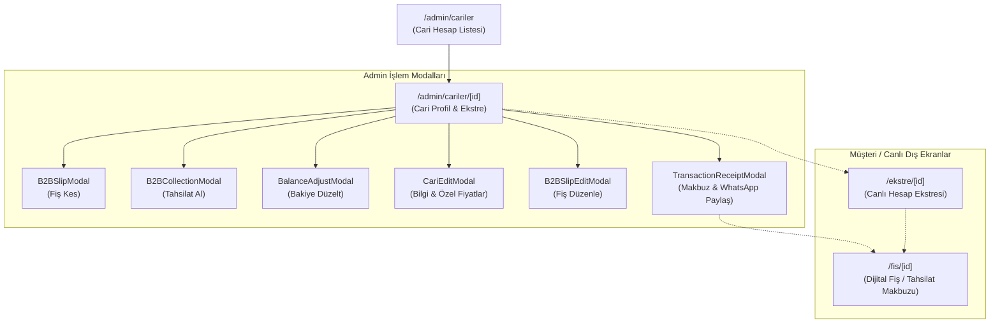

# 🍞 EkmekLab — B2B Cari Yönetimi & Ön Muhasebe Sistem Mimarisi

Bu doküman, EkmekLab B2B Cari Yönetimi, Ön Muhasebe, Fiş/Tahsilat Makbuzu ve Müşteri Canlı Ekstre modülünün mimari yapısını, veritabanı ilişkilerini, finansal hesaplama kurallarını ve güvenlik standartlarını belgeler. Gelecek geliştirmelerde bu standartların korunması esastır.

---

## 1. 🏗️ Mimari Bileşen Haritası



---

## 2. 🗄️ Veritabanı Modeli & İlişkiler (Supabase PostgreSQL)

### A. `current_accounts` Tablosu
B2B müşterilerinin ve tedarikçilerin ana hesap kaydıdır.
* `id` (UUID, Primary Key)
* `name` (text, Ticari Ünvan)
* `contact_person` (text, Yetkili Kişi)
* `phone` (text, İletişim Numarası)
* `address` (text, Açık Adres)
* `neighborhood` (text, Mahalle)
* `tax_id` (text, Vergi No / T.C.)
* `tax_office` (text, Vergi Dairesi)
* `balance` (numeric, Güncel Net Bakiye)
* `account_type` / `type` (text, `'musteri'` | `'gider'`)
* `custom_prices` (JSONB, Ürün bazlı özel toptan fiyat haritası: `{ [productId]: price }`)
* `notes` (text, Notlar)
* `created_at`, `updated_at` (timestamptz)

### B. `account_transactions` Tablosu
Hesap hareketlerinin (defter-i kebir) tutulduğu tablodur.
* `id` (UUID, Primary Key)
* `account_id` (UUID, Foreign Key -> `current_accounts.id`)
* `type` (text, `'debt'` / `'satis'`, `'credit'` / `'tahsilat'`, `'devir'`, `'odeme'`, `'storno'`)
* `amount` (numeric, İşlem Tutarı)
* `balance_after` (numeric, İşlem sonrasındaki yürüyen bakiye)
* `description` (text, İşlem Açıklaması)
* `slip_number` (text, Fiş Numarası, örn: `FİŞ-2609-001`)
* `payment_method` (text, `'nakit'` | `'banka_havale'` | `'kredi_karti'` | `'diger'`)
* `order_id` (UUID, Opsiyonel perakende/B2B sipariş ID'si)
* `date` (date)
* `created_at` (timestamptz)

---

## 3. ⚖️ Finansal Bakiye İlkeleri & Yürüyen Bakiye Bütünlüğü

1. **Simetrik Bakiye Formülü**:
   $$\text{Bakiye} = \sum \text{Borç (Satışlar)} - \sum \text{Alacak (Tahsilatlar)}$$
   - Müşteriye ürün satıldığında borç artar (`+`), bakiye yükselir (Müşteri Borçlu).
   - Müşteriden ödeme/tahsilat alındığında alacak artar (`-`), bakiye düşer.
2. **Tarihsel Bakiye (`balance_after`) Zorunluluğu**:
   - Bir müşteri fişinde (`/fis/[id]`) veya makbuz modalında kesinlikle cari hesabın *bugünkü genel bakiyesi* gösterilmez.
   - O fişin kesildiği andaki yürüyen bakiye (`tx.balance_after`) gösterilir. Aksi halde geriye dönük bakılan eski fişler kafa karıştırır ve mutabakatı bozar.
3. **Storno & Ters Kayıt**:
   - Muhasebe kayıtları keyfi olarak doğrudan silinmez; iptal edilen veya düzeltilen işlemler ters kayıt açılarak bakiye dengelenir.

---

## 4. 📄 Belge Türleri ve Ekran Ayrımı

| Belge Türü | DB Type | Rozet Rengi | İçerik Düzeni |
| :--- | :--- | :--- | :--- |
| **Teslimat Fişi** | `satis` / `debt` | Terakota (`#C85A32`) | Ürünler tablosu (Adet x Fiyat = Tutar), Ara Toplam, Kalan Bakiye |
| **Tahsilat Makbuzu** | `tahsilat` / `credit` | Zümrüt (`#059669`) | Tahsilat Özet Kartı (Ödeme Şekli, Açıklama, Tahsilat Tutarı, Kalan Güncel Borç) |
| **Devir / Düzeltme** | `devir` | Gökyüzü Mavi (`#0284C7`) | Açılış devri veya bakiye düzeltme notu ve oluşan bakiye |

---

## 5. 🔒 Müşteri Ekranları Gizlilik & Güvenlik Kuralı

- **WhatsApp Buton İzolasyonu**:
  - Müşteri-yüzlü sayfalarda ([`/fis/[id]`](file:///f:/ekmeklab_app/src/app/fis/%5Bid%5D/page.tsx) ve [`/ekstre/[id]`](file:///f:/ekmeklab_app/src/app/ekstre/%5Bid%5D/page.tsx)) **kesinlikle yeşil WhatsApp paylaşım butonu yer almaz**.
  - WhatsApp ile paylaşım yetkisi ve butonu yalnızca fırın sahibinin admin panelindeki [`TransactionReceiptModal.tsx`](file:///f:/ekmeklab_app/src/components/admin/finans/TransactionReceiptModal.tsx) bileşeninde bulunur.
- **Müşteri Aksiyonları**:
  - Fiş sayfasında: **"Yüksek Çözünürlüklü Fişi İndir (PNG)"**
  - Ekstre sayfasında: **"Excel / CSV İndir"**, **"Linki Kopyala"**, **"Yazdır / PDF"**

---

## 6. 📊 Excel & CSV Standartları

Türkçe Windows ve Excel programları CSV dosyalarını varsayılan olarak yerel ANSI veya UTF-16 kodlamasında bekler. Bozuk karakterleri (ğ, ş, ı, ö, ç, İ) ve sütun kaymalarını önlemek için:
1. Dosya başına UTF-8 BOM eklenmelidir: `let csv = "\uFEFF";`
2. Ayraç olarak virgül yerine noktalı virgül (`;`) kullanılmalıdır.
3. Ondalık sayılarda nokta yerine virgül kullanılmalıdır (`amount.toFixed(2).replace(".", ",")`).

---

## 7. 🏷️ Özel Toptan Fiyatlar (Custom Prices) Mantığı

- `current_accounts.custom_prices` kolonu bir JSONB nesnesidir:
  ```json
  {
    "prod_ekmek_01": 45.0,
    "prod_baget_02": 30.0
  }
  ```
- Fiş kesilirken (`B2BSlipModal`), sistem ürünün standart fiyatı yerine cariye tanımlı özel fiyatı otomatik olarak getirir.
- Admin Cari Detay sayfasında ([`/admin/cariler/[id]`](file:///f:/ekmeklab_app/src/app/admin/cariler/%5Bid%5D/page.tsx)) üst bardaki **"Özel Fiyatlar"** butonu veya bilgi kartındaki rozetler ile fiyatlar doğrudan yönetilebilir.

---

## 8. 🗑️ Cari Silme Protokolü & Foreign Key Koruması

PostgreSQL ilişkisel bütünlüğü gereği, `account_transactions` tablosunda `account_id` referansı bulunan bir cari doğrudan silinemez (FK violation).
Bu nedenle silme akışı:
```typescript
// 1. Önce bağlı tüm hesap hareketleri silinir
await supabase.from("account_transactions").delete().eq("account_id", id);
// 2. Ardından ana cari kaydı silinir
await supabase.from("current_accounts").delete().eq("id", id);
```
Bu işlem geri alınamaz olduğundan admin arayüzünde daima açık kullanıcı onayı (`window.confirm`) alınır.

---

## 9. 🖨️ Kağıt Estetiği & Görsel İndirme (HTML-to-Image) Güvenliği

Fiş ve ekstre görselleri oluşturulurken metinlerin veya sayıların altlarının kesilmesini önlemek için:
- Ana kağıt kaplayıcısında `overflow-hidden` yerine `overflow-visible` tercih edilmelidir.
- Metin kutularında `leading-normal` ve `pb-1` minimum dikey boşluğu sağlanmalıdır.
- `html2canvas` render işleminde `scale: 2` ve şeffaf olmayan zemin rengi (`#FBF9F5`) kullanılmalıdır.
