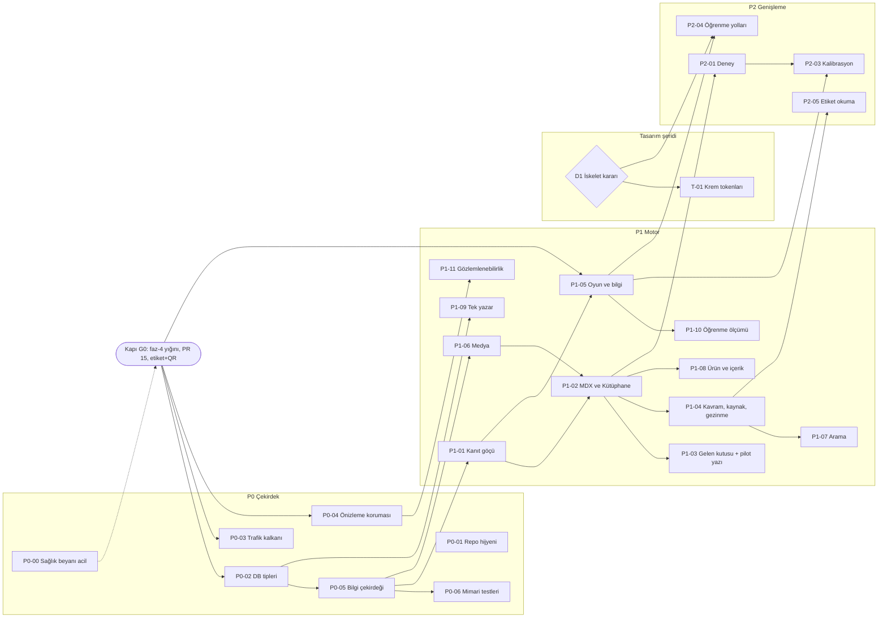

# EkmekLab — İş Paketleri (ajan brifingleri)

> Mimari: [`MIMARI.md`](MIMARI.md) · Kararlar: [`adr/`](adr/) · Faz durumu: [`YOL_HARITASI.md`](YOL_HARITASI.md).
> Her paket tek başına bir ajana verilebilir: **paketin bölümünü + "Ortak kurallar"ı** kopyala-yapıştır.
> Sıra ve paralellik §2'deki diyagramda. Bir paket bitince YOL_HARITASI durum tablosu güncellenir.

---

## 1. Ortak kurallar (her pakete eklenir)

**Şablon**
```
## <ID> <Başlık>
Taban: main @ <commit> (Kapı G0 sonrası)
Oku: AGENTS.md · docs/MIMARI.md §<bölüm> · <dosyalar>
Yazma kapsamı (yalnız): <glob listesi — paylaşılan dosyalar dahil açıkça>
Dokunma: <glob>
Sözleşme: <export / dosya / tablo>
Kabul (DoD): <komut + beklenen çıktı; yalnız repo içinde, Supabase env'siz koşabilen>
Migration: yok | var → numara birleşme anındaki sıradaki boş numara; ÖNCE/SONRA
Tahsin (önizlemede bakacağı): <1 satır> · Tahsin adımı: nereye → ne göreceksin → süre
Dur ve sor: <koşullar>
Dal: <id-kisa-ad> → main
```

**Ortak DoD:** `npm run typecheck` + `npm test` + `npm run build` yeşil; `any` yok; tarih/saat `src/lib/time/istanbul.ts` ile; `git diff --name-only main...` yazma kapsamıyla eşleşir.

**Ajan kuralları**
- Service-role anahtarıyla script çalıştırmaz; canlı veritabanına bağlanmaz. SQL'i Tahsin çalıştırır (önce sonu `ROLLBACK` kuru deneme, sonra `COMMIT`).
- `$$` içeren SQL'i JS `replace` ile düzenlemez (AGENTS.md).
- Bir iddiaya `review` alanını yalnız Tahsin'in açık onayından sonra, güncel `claimHash` ile yazar.
- İskelet/menü, tema, ana sayfa, içerik kapsamı seçmez; bunlar Tahsin'in kararı.
- Aynı anda Tahsin'in bakmasını bekleyen **en fazla 2 PR** açık olur.
- Migration numarası birleşme anında verilir (sıradaki boş numara); PR gövdesinde "uygulamaya göre ÖNCE/SONRA" yazılır.
- PR gövdesi Türkçe; "Tahsin önizlemede neye bakacak" satırı zorunlu.

**Paralel şeritler ve dosya sahipliği**

| Şerit | Paketler | Sahip olduğu yollar |
|---|---|---|
| A Platform | P0-01, P0-02, P0-03, P0-04, P0-06, P1-09, P1-10, P1-11 | `.github/**`, `src/proxy.ts`, `src/lib/{kernel,security,engagement,settings}/**`, `src/app/api/{settings,availability,track,health,cron,orders}/**`, `src/hooks/{usePayments,useAdminOrders}.ts`, `scripts/**`, `tests/e2e/**` |
| B Bilgi/İçerik | P0-05, P1-01…P1-07, P1-12 | `content/**`, `src/lib/{knowledge,editorial}/**`, `src/components/{editorial,journal}/**`, `src/app/{kutuphane,kavram,kaynak,__checks__}/**`, `src/lib/game/**` ve `src/components/game/**` (yalnız P1-05) |
| C Ürün | P0-00, P1-08 | `src/app/urun/**`, `src/app/e/**`, `src/components/storefront/**`, `src/app/admin/urunler/**`, `src/app/api/admin/products/**`, `src/lib/products/**` |

**Paylaşılan dosyalar** (fazda tek sahip; diğerleri birleşmeden önce `main`'e rebase eder): `package.json`, `tsconfig.json`, `vitest.config.ts` → P0'da P0-02, P1'de P1-02 · `next.config.ts`, `tailwind.config.ts` → P1-02 · `AGENTS.md`, `docs/YOL_HARITASI.md`, `docs/MIMARI.md` → mimar · `src/app/layout.tsx`, `src/components/common/**` → P1-04.

---

## 2. Sıra



P0-01 bağımsızdır (G0 ile paralel yürüyebilir). P1-12 ve tasarım şeridi Tahsin kararına bağlıdır.

---

## 3. Kapı G0 — Uçuştaki işi indir

Yeni paket açılmadan önce:
1. `faz-4-sepet-onar` → `faz-4-qr-olcum` (021 migration'ı kod birleşmeden **ÖNCE**) → `faz-4-konum-yasal` sırayla `main`'e.
2. PR #15 (`faz-4-oyun-cavdar`).
3. Etiket + QR (`faz-4-baski`; şartname: 5×7 cm tek etiket, logo + ekmek adı + isteğe bağlı tek satır + QR; adres/tarih/gramaj yok; `/admin/baski` adet + yazıcı x/y kaydırma).

**DoD:** `git fetch && git cat-file -e origin/main:src/lib/track.ts && git cat-file -e origin/main:supabase/migrations/021_funnel_events.sql` başarılı.

---

## 4. Faz P0 — Çekirdek

### P0-00 Sağlık beyanı acil kapatma
- **Taban:** `faz-4-konum-yasal` üzerine (yığın ürün sayfasına dokunuyor; yığının son halkası olarak birleşir).
- **Oku:** AGENTS.md · `docs/MARKA.md` §3 · `docs/BILIM.md` başlığı · MIMARI.md V1.
- **Yazma kapsamı:** `src/app/urun/[slug]/page.tsx`, `src/components/storefront/ProductModal.tsx`, `src/app/admin/urunler/page.tsx`, `src/data/journalArticles.ts`, gerekiyorsa `src/app/kutuphane/page.tsx` (gizleme).
- **Dokunma:** `src/types/**`, `src/app/api/**`, `supabase/**` (DB verisi kalır).
- **İş:** `masterclass.healthBenefit` render'ı (ürün sayfası 437-444, modal 224) ve admin formundaki "Sindirim / sağlık" alanı (564) kalkar. Karakılçık yazısındaki sağlık cümleleri ("Kansızlığı Önler", "%92", "şifa") çıkarılır; anlam kalmıyorsa yazı listeden gizlenir. Çiğ süt yazısı, içerik kapsamı kararına kadar listeden gizlenir. Bu, Tahsin'in kayıtlı kuralının uygulanmasıdır; yeni karar değildir.
- **DoD:** `rg -n "healthBenefit" src/app src/components` boş · `rg -in "şifa|kansızl|önler" src/data` boş · ortak DoD.
- **Migration:** yok.
- **Tahsin (önizleme):** ürün sayfasında "sağlık" kutusu yok; Kütüphane listesinde yalnız uygun yazı.
- **Dur ve sor:** gizlenecek yazının yerine ne konacağı (boş liste mi, "yakında" mı).
- **Dal:** `p0-00-saglik-beyani`.

### P0-01 Repo ve ajan bağlamı hijyeni
- **Taban:** `main` (G0'ı beklemez).
- **Oku:** AGENTS.md · MIMARI.md V12.
- **Yazma kapsamı:** `.gitignore`, `.github/**`, `docs/**` (yalnız taşıma; `YOL_HARITASI.md`, `MARKA.md`, `OYUN*.md`, `BILIM.md`, `SIPARIS_AKISI_DENETIMI.md`, `MIMARI.md`, `IS_PAKETLERI.md`, `adr/**` hariç), kök `instructions.md`, kök `settings.json`, `supabase/schema.sql` (yalnız başa not).
- **Dokunma:** `src/**`, `supabase/migrations/**`.
- **İş:**
  - `local_llm_bridge/`, `playwright-report/`, `test-results/`, `.idea/`, `.firebase/`, `firebase-debug.log`, `scripts/__pycache__` → `git rm -r --cached` + `.gitignore`. Yerel dosyalar silinmez.
  - `.github/copilot-instructions.md`, `.github/COPILOT_GUIDE.md`, `.github/copilot-file-header-template.md` → 3 satırlık "AGENTS.md'yi oku" işaretçisi ya da `docs/arsiv/`.
  - Kök `instructions.md`, `settings.json` ve eski dokümanlar → `docs/arsiv/` + `docs/arsiv/README.md` ("tarihsel; güncel değil").
  - `docs/DESIGN_SYSTEM.md` → MARKA §8'e işaretçi (eski içerik arşive).
  - `supabase/schema.sql` başına: "Referans dosya; canlı şema 013+ numaralı migration'larla değişti. Çalıştırmayın."
  - `.github/workflows/ci.yml`: tüm `pull_request`'lerde koşar; izlenmemesi gereken yollar geri gelirse kıran adım (`git ls-files <yollar>` boş değilse çık).
- **DoD:** `git ls-files local_llm_bridge playwright-report test-results .idea .firebase firebase-debug.log scripts/__pycache__` boş · `git grep -il "flutter" -- .github` boş · ortak DoD.
- **Tahsin adımı:** GitHub → depo → Settings → General → "Default branch" → kalem → `main` → "Update" (2 dk). Silinebilecek uzak dalların listesi PR gövdesinde; silme kararı onun.
- **Dal:** `p0-01-repo-hijyeni`.

### P0-02 DB tipleri ve tek kaynak enum'lar
- **Taban:** `main` @ G0 sonrası.
- **Oku:** AGENTS.md · MIMARI.md §2.5 identity/kernel · `src/types/index.ts`, `src/types/admin.ts`, `src/lib/supabase/*`.
- **Yazma kapsamı:** `package.json` (script), `src/types/database.ts` (üretilen), `src/lib/kernel/enums.ts`, `src/lib/supabase/*` (yalnız yeni tipli fabrika), `src/types/order.ts` (silinir), `src/types/admin.ts` (ölü tipler), `vitest.config.ts`, `tsconfig.json`, durum/ödeme/rol birleşimi tanımlayan dosyalar (yalnız tanımı `enums.ts`'e bağlamak için).
- **Dokunma:** davranış değiştiren hiçbir kod; `supabase/**`.
- **İş:**
  - `package.json`: `"db:types": "npx supabase gen types typescript --project-id <ref> > src/types/database.ts"` (Docker gerekmez; proje kimliği `NEXT_PUBLIC_SUPABASE_URL`'deki alt alan).
  - `src/lib/kernel/enums.ts`: `OrderStatus`, `PaymentMethod`, `Role` = `Database["public"]["Enums"][...]`; diğer 5–6 tanım bunlara bağlanır.
  - Silinir: `src/types/order.ts` (içe aktaran yok); `types/admin.ts` içindeki Supplier, ExpenseRecord, CashMovement, TrustedDevice ve DB'de olmayan `editor`/`support` rolleri (`AdminSidebar.tsx` varsayılanı buna göre).
  - `createTypedAdminClient()` (yeni kod için; eski çağrılar dokunulduğunda geçer).
  - `vitest.config.ts`: `alias` → `@`, `@content` (`./content`), `server-only` → `node_modules/next/dist/compiled/server-only/empty.js`; `include: ["src/**/*.test.{ts,tsx}"]`. `tsconfig.json`: `"@content/*": ["./content/*"]`.
- **DoD:** `rg -c "user_role_type" src/types/database.ts` ≥1 · durum/ödeme/rol birleşimi yalnız `src/lib/kernel/enums.ts`'te tanımlı (`rg -n "type (OrderStatus|PaymentMethod|Role) ="` → 1 dosya) · ortak DoD.
- **Tahsin adımı (5 dk):** Supabase → sağ üst profil → "Access Tokens" → "Generate new token" → kopyala. Kendi PowerShell terminalinde `$env:SUPABASE_ACCESS_TOKEN="<token>"`, sonra `npm run db:types` → `src/types/database.ts` oluşur. Token sohbete yazılmaz.
- **Dur ve sor:** üretilen tipler mevcut kodla 20'den fazla tip hatası çıkarırsa (kapsam büyür).
- **Dal:** `p0-02-db-tipleri`.

### P0-03 Trafik kalkanı
- **Taban:** `main` @ G0 sonrası.
- **Oku:** AGENTS.md · MIMARI.md V7, §2.4, §2.6 · `node_modules/next/dist/docs/01-app/03-api-reference/03-file-conventions/proxy.md` · `src/middleware.ts`, `src/lib/security/rateLimiter.ts`, `src/app/api/settings/route.ts`, `src/hooks/useStoreSettings.ts`.
- **Yazma kapsamı:** `src/middleware.ts` → `src/proxy.ts`, `src/lib/security/**`, `src/app/api/{settings,availability,cron}/**`, `src/app/api/orders/{create,[id],[id]/cancel}/route.ts` (yalnız `getClientIp` kopyaları), `src/hooks/useStoreSettings.ts`, `src/lib/settings/**`.
- **Dokunma:** yetkilendirme davranışı (yalnız matcher daralır).
- **İş:**
  - `export function proxy`; `config.matcher` = `["/admin/:path*", "/kurye/:path*", "/hesabim/:path*", "/api/admin/:path*"]`.
  - `/api/settings`: `force-dynamic` kalkar; `unstable_cache` (etiket `settings`, 60 sn) + `Cache-Control: public, s-maxage=60, stale-while-revalidate=300`; `isCutoffPassed` yanıttan çıkar, istemci `isPastCutoff` (`istanbul.ts`) ile hesaplar; admin ayar yazımında `revalidateTag("settings", "max")`.
  - `rateLimit(store, { failMode })`: enjekte edilebilir depo (Postgres deposu mevcut RPC'yi sarar); anahtarda IP karması; `getClientIp` tek kaynak.
  - `/api/availability` POST: IP 60/10 dk, `failMode: "open"`.
  - Mevcut cron'a `rate_limit_buckets` temizliği (24 saatten eski).
- **DoD (mekanik):** `proxy.test.ts` → `config.matcher` tam olarak 4 desen · `rateLimit.test.ts` → 61. çağrı reddedilir; depo hata atınca `open` geçirir, `closed` reddeder · `settings.route.test.ts` → `Cache-Control` beklenen değer · `rg -n "function getClientIp" src` → 1 · ortak DoD.
- **Migration:** yok.
- **Tahsin (önizleme):** ana sayfa, sepet, admin girişi, `/hesabim` normal; siparişlerim listesi açılıyor.
- **Dur ve sor:** giriş yapmış müşterinin oturumu proxy dışındaki sayfalarda düşüyorsa.
- **Dal:** `p0-03-trafik-kalkani`.

### P0-04 Önizleme → canlı koruması
- **Taban:** `main` @ G0 sonrası.
- **Oku:** AGENTS.md · MIMARI.md V11, §2.6 · `docs/adr/0005-staging-yok-kabul-edilen-risk.md`.
- **Yazma kapsamı:** `src/lib/kernel/env.ts`, `src/lib/notify/telegram.ts` (yalnız `appEnv` kullanımı), `src/lib/track.ts` / `src/app/api/track/route.ts` (yalnız `env` etiketi), `scripts/**`, `tests/e2e/**`, `playwright.config.ts`.
- **İş:** `appEnv()` (`VERCEL_ENV` → `production|preview|development`); Telegram ve olay havuzları onu kullanır; `tests/e2e/order-flow.spec.ts` ve `scripts/cleanup_test_orders.mjs` `ALLOW_PROD_WRITES=1` ve `TEST` öneki olmadan çalışmaz; `scripts/verify_after_migration.mjs` ve Firebase'e yazan script'ler (`delete_users.js`, `create_chatbot_*.js`, `seed_*.js`, `update_blog_published.js`) silinir.
- **DoD:** `env.test.ts` · `rg -l "SUPABASE_SERVICE_ROLE_KEY" scripts tests` listesindeki her dosya `rg -l "ALLOW_PROD_WRITES"` listesinde · ortak DoD.
- **Dal:** `p0-04-onizleme-korumasi`.

### P0-05 Bilgi çekirdeği
- **Taban:** `main` @ P0-02 sonrası.
- **Oku:** AGENTS.md · MIMARI.md §2.5 knowledge (tamamı), K-kodları tablosu.
- **Yazma kapsamı:** `src/lib/knowledge/**`, `src/lib/editorial/define.ts`, `content/{sources,claims,concepts}/index.ts` (boş kayıtlar), `src/app/__checks__/content.check.test.ts`.
- **Dokunma:** `src/lib/game/**`, `src/data/**`, `src/app/kutuphane/**` (göç P1'de).
- **Sözleşme:** `types.ts` (girdi tipleri), `define.ts` (`defineSources/defineClaims/defineConcepts`, `claimHash`; registry'yi içe aktarmaz), `registry.ts` (birleştirme + `SourceId/ClaimId/ConceptId` + ayrı referans denetimi), `refs.ts` (`ContentRef`), `validate.ts` (`validateGraph`), `lint.ts` (`HEALTH_TERMS`, fayda fiili listesi), `query.ts`.
- **DoD:**
  - `src/lib/knowledge/__fixtures__/`: K001, K002, K003, K004, K005, K006 (içerik yüzeyi), K008, K011 için kötü örnek → `validateGraph` beklenen kodu döner (≥8 test); iyi örnek 0 hata.
  - Kopuk `ClaimId` içeren fixture'da `// @ts-expect-error` **kullanılmış** sayılır (typecheck yeşil).
  - `const` çıkarımının `string`'e düşmediğini kanıtlayan tip testi (`ClaimId` bir literal birleşimidir).
  - ortak DoD.
- **Dal:** `p0-05-bilgi-cekirdegi`.

### P0-06 Mimari testleri
- **Taban:** `main` @ P0-05 sonrası.
- **Oku:** MIMARI.md §2.2 (R1–R5) · `docs/adr/0008-mimari-testleri-ts7.md`.
- **Yazma kapsamı:** `src/lib/kernel/arch.test.ts`, `src/lib/kernel/__fixtures__/arch-ihlal/**`, IO modüllerinin ilk satırı (`import "server-only"`).
- **İş:** import'ları regex ile toplayan, `@/` → `src/` eşleyen, izinli kenar tablosuyla (MIMARI §2.2 diyagramı) karşılaştıran test; R4 (`src/lib/firebase`); R5 cırcırı (`<any, any, any>|SupabaseClient<any` sayısı başlangıç değerini aşamaz). Mevcut ihlaller `KNOWN_VIOLATIONS` listesinde sayıyla dondurulur.
- **DoD:** test yeşil · `arch-ihlal` fixture'ı testin içinde beklenen ihlal olarak yakalanır · `next build` yeşil (server-only eklemeleri istemciye sızmıyor) · ortak DoD.
- **Dal:** `p0-06-mimari-testleri`.

---

## 5. Faz P1 — Minimal Viable Engine

### P1-01 Kanıt göçü
- **Taban:** `main` @ P0-05 sonrası.
- **Oku:** MIMARI.md §2.5 knowledge · `docs/BILIM.md` · `src/lib/game/content/cards.ts` · `src/data/journalArticles.ts` · §7 "Kanıt ajanı" brifingi.
- **Yazma kapsamı:** `content/{sources,claims,concepts}/**`, `docs/BILIM.md` (üretilen özet ya da arşiv notu).
- **Dokunma:** `src/lib/game/**` (bağlama P1-05'te).
- **İş:** BILIM.md + `cards.ts` 16 kaynak + yazı tohumu DOI'leri → `content/sources`; BILIM iddiaları → `content/claims` (tahmini 60–90); 35 kartın kavramları → `content/concepts` (`nick`, `identity` satırları ilgili iddiaya bağlı); her DOI Crossref'te doğrulanır (`api.crossref.org/works/<doi>`); kanıt ajanı her iddia için `supportCheck` + `locator` yazar. Tüm iddialar `review: null`.
- **DoD:** K001–K005, K011 sıfır · BILIM.md'deki her DOI bir `Source` · her iddiada `supportCheck` · `desteklemiyor` olan iddia `tartismali` ya da çıkarılmış · Crossref doğrulama günlüğü PR gövdesinde · ortak DoD.
- **Ön şart:** NotebookLM bağlantısı (Tahsin: `.venv/Scripts/notebooklm.exe login`).
- **Tahsin adımı:** PR'daki iddia tablosunda yalnız **ifadeyi** okur ("benim ağzımdan böyle denir mi?"), ~2 dk/iddia, oturumlara bölünebilir; onay yorumu yazar. Ajan onaylananlara `review` (güncel hash ile) ekler.
- **Dal:** `p1-01-kanit-gocu`.

### P1-02 MDX yayın hattı ve Kütüphane
- **Taban:** `main` @ P1-01 + P1-06 sonrası.
- **Oku:** `node_modules/next/dist/docs/01-app/02-guides/mdx.md` · `.../03-file-conventions/mdx-components.md` · MIMARI.md §2.4, §2.5 editorial.
- **Yazma kapsamı:** `package.json`, `next.config.ts`, `tailwind.config.ts`, `tsconfig.json`, `src/mdx-components.tsx`, `src/components/editorial/**`, `src/lib/editorial/**`, `content/articles/**`, `src/app/kutuphane/**`, `src/app/sitemap.ts`, silinecek dosyalar.
- **İş:**
  - Bağımlılıklar: `@next/mdx`, `@mdx-js/loader`, `@mdx-js/react`, `@types/mdx`, `remark-gfm`. Turbopack: eklentiler **string adla**.
  - `content/articles/<slug>/meta.ts` (`defineArticle`) + `index.mdx` (yalnız gövde). `src/lib/editorial/index.ts` statik import'lu barrel; MDX gövdesi `import()` ile.
  - `/kutuphane`, `/kutuphane/[slug]`: sunucu bileşeni, `generateStaticParams`, `dynamicParams = false`, Article + VideoObject JSON-LD, yazı başına OG görseli.
  - `<Claim>`, `<Concept>`, `<Figure>`, `<Video>`, `<Sources/>` (`src/components/editorial/`).
  - `tailwind.config.ts` `content`'e `./content/**/*.mdx`.
  - Sitemap indeksten (geçersiz `new Date("Eylül 2026")` kalkar).
  - Tohum yazıları göçü: sağlık cümlesi yok; doğrulanamayan yazı `taslak`.
  - **Silinir:** `src/lib/journal/journalStorage.ts`, `src/hooks/useJournal.ts`, `src/data/journalArticles.ts`, `src/app/kutuphane/yonetim/`, `src/app/admin/kutuphane/` (+ menü linki). `journal_articles` tablosu silinmez.
- **DoD:** build route tablosunda `/kutuphane/[slug]` ● (SSG) · `rg -l '"use client"' src/app/kutuphane` boş · K009 sıfır · yalnız bir yazıda kullanılan Tailwind sınıfı `.next/static/css` içinde bulunur · derleme çıktısında `/kutuphane/yonetim` yok · ortak DoD.
- **Tahsin (önizleme):** Kütüphane listesi ve bir yazı; kaynak listesi yazının sonunda.
- **Dur ve sor:** Next 16 MDX dokümanıyla çelişen bir durum; Turbopack eklenti hatası.
- **Dal:** `p1-02-mdx-kutuphane`.

### P1-03 Gelen kutusu + pilot yazı
- **Taban:** `main` @ P1-02 sonrası.
- **Oku:** §7 "Gelenden taslağa" ve "Kanıt ajanı" brifingleri · `docs/MARKA.md` §3 (ses ve ton).
- **Yazma kapsamı:** `content/gelen/**`, `content/articles/<pilot>/**`, `content/claims/**` (yeni iddialar).
- **İş:** `content/gelen/README.md` (Tahsin ne bırakır: video dökümü, not, defter fotoğrafı; ajan ne üretir); pilot yazı uçtan uca: gelen → taslak → kanıt ajanı → Tahsin'in çerçeve okuması → yayın.
- **DoD:** pilot yazı `yayinda`, K-kodları sıfır, `fromInbox` dolu · ortak DoD.
- **Tahsin adımı:** konuyu seçer ve malzemeyi bırakır; ~15 dk çerçeve okuması.
- **Dal:** `p1-03-pilot-yazi`.

### P1-04 Kavram ve kaynak sayfaları + nötr gezinme
- **Taban:** `main` @ P1-02 sonrası.
- **Yazma kapsamı:** `src/app/kavram/**`, `src/app/kaynak/**`, `content/nav/links.ts`, `src/components/common/{Navbar,Footer}.tsx` (yalnız bağlantı listesi), `src/app/layout.tsx` (gerekirse), `src/app/sitemap.ts`.
- **Dokunma:** `src/app/page.tsx` (ana sayfa değişmez).
- **İş:** `/kavram/[slug]` (3 katman + iddialar + kaynaklar + ilgili yazılar + "Oyunda gör"), `/kaynak/[id]` ("bu kaynağa dayanan iddialarımız"), DefinedTerm JSON-LD; `content/nav/links.ts` → Navbar/Footer'a Kütüphane ve Kavramlar bağlantısı.
- **DoD:** ≥1 incelenmiş iddiası olan her kavramın sayfası var (indeks ↔ `generateStaticParams` testi) · ortak DoD.
- **Tahsin adımı:** `/kavram` ve `/kaynak` adlarını onaylar (yayından önce değiştirmek bedava).
- **Dal:** `p1-04-kavram-kaynak`.

### P1-05 Oyun ↔ bilgi
- **Taban:** `main` @ P1-01 + PR #15 sonrası.
- **Oku:** `docs/OYUN_V3.md` · `src/types/game.ts` · `src/lib/game/**` · MIMARI.md §2.5 learning.
- **Yazma kapsamı:** `src/lib/game/**`, `src/components/game/**`, `src/types/game.ts`, `src/components/editorial/{Micro,Predict}.tsx`.
- **İş:** `CodexCard` → `CodexCardV4` (görünür metin `Concept.layers` + `nick` + `identity`); `params.ts` sabitleri `Param` (`claim` ya da `fitted`); tahminlerin `reveal`'ı iddia kimliğine bağlanır; ilerleme v4 + `migrateProgress`; `<Micro preset>`, `<Predict id>` (tembel yükleme); `sim.ts` modül düzeyi durum kalkar; `toContentRefs()` (K002 kart).
- **DoD:** v3'te görünen her kart alanı v4'te aynı (35 kart snapshot testi) · 23 motor testi yeşil + "her `Param` ya `claim` ya `fitted`; `claim`'li değer iddianın aralığında" testi · `rg "doi.org" src/lib/game` boş · v3 ilerlemesi olan tarayıcı kayıpsız açılır (test) · ortak DoD.
- **Tahsin (önizleme):** oyunda bir kartı aç; metin ve kaynak aynı.
- **Dal:** `p1-05-oyun-bilgi`.

### P1-06 Medya kaydı ve görsel hattı
- **Taban:** `main` @ P0-05 sonrası.
- **Yazma kapsamı:** `content/media/**`, `src/lib/editorial/media.ts`, `public/atelier/**`, `next.config.ts` (yalnız `images.remotePatterns`), `supabase/migrations/<sıradaki>_media_bucket.sql`, `supabase/tests/<sıradaki>_smoke.sql`, `package.json` (script).
- **İş:** `defineMedia` (`license: "own" | "cc-by" | "cc-by-sa" | "cc0" | "stock-licensed" | "adapted-from-publication"` + kaynak kimliği, `credit`, `alt`, boyut); `media` bucket (admin yazma, herkese okuma, `SET search_path`, REVOKE/GRANT kuralları) + smoke; `remotePatterns`'e Supabase ana bilgisayarı; `public/atelier/*.png` → WebP/AVIF; `npm run content:media-report` (stok listesi).
- **DoD:** K007 sıfır · rapor stok görselleri listeler · en büyük `public/atelier` dosyası < 300 KB · ortak DoD.
- **Migration:** ÖNCE (yükleme arayüzünden önce).
- **Tahsin adımı:** migration'ı SQL Editor'de kuru deneme → gerçek (5 dk); hangi görselin kendisinin olduğunu rapordan işaretler.
- **Dal:** `p1-06-medya`.

### P1-07 Statik arama
- **Taban:** `main` @ P1-04 sonrası.
- **Yazma kapsamı:** `src/lib/editorial/search.ts`, `src/app/arama/**` (ya da gezinmeye gömülü arama), `src/components/editorial/Search.tsx`.
- **İş:** derlemede indeks (yazı, kavram, efsane); Türkçe normalizasyon (ı/i, ş/s, ğ/g, ç/c, ö/o, ü/u, büyük-küçük); bağımlılıksız ters indeks; tembel yüklenen arayüz.
- **DoD:** normalizasyon ve sıralama testleri · 500 belgelik fixture'da indeks < 300 KB (bütçe testi) · ortak DoD.
- **Dal:** `p1-07-arama`.

### P1-08 Ürün ↔ içerik bağları
- **Taban:** `main` @ P1-02 sonrası.
- **Yazma kapsamı:** `src/app/urun/**`, `src/components/storefront/**`, `src/app/api/admin/products/route.ts`, `src/lib/products/**`, `src/components/journal/EditorialArticleView.tsx` (P1-02 kaldırmadıysa).
- **İş:** yazı `meta.products` ↔ ürün sayfasında "İlgili yazılar"; `ProductModal.tsx:235` ölü çapalar → kavram linkleri; `allProducts[0]` geri dönüşü kalkar; admin ürün API'si `HEALTH_TERMS` içeren metni zod ile reddeder; ürün yüzeyi `ContentRef`'leri (`surface: "urun"`) → K006/K010. Formül/oran kartı **yok** (MARKA §7: yerine video).
- **DoD:** ürün yüzeyinde K006 sıfır · `api/admin/products` testi sağlık terimli metni 400 ile reddeder · ortak DoD.
- **Tahsin (önizleme):** ürün sayfasının altında ilgili yazı bağlantısı.
- **Dal:** `p1-08-urun-icerik`.

### P1-09 Ticaret tek-yazar bütünlüğü
- **Taban:** `main` @ P0-02 sonrası.
- **Oku:** AGENTS.md §4, §6 · `supabase/migrations/018_order_lifecycle.sql` (`mark_order_delivered` değişmezleri) · `src/hooks/usePayments.ts`, `src/hooks/useAdminOrders.ts`, `src/components/admin/siparisler/PaymentRecordModal.tsx`, `src/app/api/orders/[id]/assign-courier/route.ts`.
- **Yazma kapsamı:** `supabase/migrations/<sıradaki>_record_order_payment.sql` + `<sıradaki+1>_single_writer.sql` + smoke'ları, `src/app/api/admin/orders/[id]/payments/route.ts`, `src/app/api/orders/[id]/assign-courier/route.ts`, `src/hooks/{usePayments,useAdminOrders}.ts`, `src/components/admin/siparisler/PaymentRecordModal.tsx`, `src/app/admin/AdminLayoutClient.tsx`.
- **İş:** `record_order_payment(...)` RPC (ödeme satırı + `payment_status` tek işlem; `SET search_path = public, pg_temp`; `REVOKE ALL ... FROM PUBLIC, anon, authenticated`; `GRANT EXECUTE ... TO service_role`) + smoke; `POST /api/admin/orders/[id]/payments` (`requireAdmin` ilk satır); `PaymentRecordModal` ve `assignCourier` API'ye geçer; `assign-courier` durum beyaz listesi (yalnız `kuryede`); `AdminLayoutClient` eski durumlar (`pending`/`processing`); ikinci migration: `orders`/`payments`/`order_status_history` tarayıcı politikaları SELECT'e.
- **DoD:** `rg -U -n 'from\("(orders|payments|order_status_history)"\)\s*\.(update|insert|upsert|delete)' src --glob '!src/app/api/**'` boş (bugün 4 eşleşme) · politika migration'ı smoke'u tarayıcı UPDATE'inin reddini doğrular · ortak DoD.
- **Migration:** RPC **ÖNCE**, politika **SONRA** (kod yayınından sonra).
- **Tahsin adımı:** RPC'yi kuru deneme → gerçek; birleştir; önizlemede/canlıda bir TEST siparişine ödeme kaydet; sonra politika migration'ı (toplam ~15 dk).
- **Dur ve sor:** cari siparişte ödeme kaydının defterle etkileşimi; `mark_order_delivered` ile çakışma.
- **Dal:** `p1-09-tek-yazar`.

### P1-10 Öğrenme ölçümü (021 genişletmesi)
- **Taban:** `main` @ P1-05 sonrası.
- **Yazma kapsamı:** `src/lib/engagement/**` (`src/lib/track.ts` buraya taşınır), `src/app/api/track/route.ts`, `src/app/api/cron/**`, `supabase/migrations/<sıradaki>_funnel_events_v2.sql` + smoke, `src/components/game/**` ve `src/app/kutuphane/**` (yalnız `track` çağrısı), `src/app/kvkk/page.tsx`, `src/app/gizlilik/page.tsx` (metin taslağı).
- **İş:** `funnel_events`'e `props jsonb` (`pg_column_size(props) <= 2048` CHECK), `env` sütunu, CHECK'e `learning_session`; `learning_session` yalnız ≥30 sn ya da ≥1 kart, %20 örnek, pagehide'da 1 kez; `/api/track` bellek içi sınır + 2 KB gövde sınırı (Postgres sınırlayıcı kullanılmaz); cron saklama 13 ay; KVKK/gizlilik metin değişikliği **hukuki teyit** bayrağıyla (PR'da ayrı onay).
- **DoD:** `events.test.ts` (zod, 2 KB, eşik ve örnekleme saf fonksiyonu) · önizleme olayı `env='preview'` (birim testi) · ortak DoD.
- **Migration:** ÖNCE (kod tablo/sütun yoksa sessiz atlar — 021 deseni).
- **Dal:** `p1-10-ogrenme-olcumu`.

### P1-11 Gözlemlenebilirlik
- **Taban:** `main` @ P0-04 sonrası.
- **Yazma kapsamı:** `src/instrumentation-client.ts`, `sentry.*.config.ts`, `src/lib/kernel/{log,migrations}.ts`, `src/app/api/health/**`, dokunulan API rotalarında `console.*` satırları.
- **İş:** istemci Sentry; `sentry.client.config.ts` silinir; örnekleme 0,1; Replay yok; `beforeSend` ve `beforeBreadcrumb` URL'lerden sorgu dizesini (`t` dahil) siler; `kernel/log.ts` (JSON satır); `/api/health` (genel `{ok}`, `?detail=1` + `requireAdmin` → `EXPECTED_MIGRATIONS` ile `app_migrations` farkı; yalnız ≥013).
- **DoD:** `sentry.config.test.ts` (Replay entegrasyonu yok; `?t=` içeren URL temizlenir) · `migrations.test.ts` (`EXPECTED_MIGRATIONS` = `supabase/migrations` dizinindeki ≥013 dosyalar) · `console.*` sayısı artmaz (cırcır) · ortak DoD.
- **Dal:** `p1-11-gozlem`.

### P1-12 Kütüphane ve oyunun açılması (karar kapısı)
- Tahsin "hazır" deyince: `robots.ts`'ten `/laboratuvar` disallow kalkar, `noindex` kalkar, gezinmeye bağlantı eklenir. Yalnız metadata/gezinme değişikliği.

---

## 6. Tasarım şeridi (Tahsin kararı bekliyor)

### D1 İskelet kararı (✅ Karar verildi — Tahsin, 7 Eki 2026)
Tahsin Seçenek 4'ü seçti: **Kitle / Vitrin (Fırın ritmi ve taze ekmek siparişi önde, bilim ve araçlar arkasında)**.
- **Ana Sayfa Yapısı:** Taze fırın ritmi, haftalık ön sipariş ve ürün kataloğu vitrinde önde; hemen ardından "Nasıl Üretiyoruz?" ve zanaat otoritesi katmanı (Laboratuvar, Kütüphane, Kavramlar Sözlüğü ve Profesyonel Fırıncı Araçları `/arac`).
- **Tasarım Teması:** Atölye Kremi (`#F6EEDF` zemin, `#FBF6EC` kart, `#3B1E1A` mürekkep, `#B4532A` terakota vurgu; Fraunces + Inter).
- **Sonraki Adım:** Ana sayfayı (`src/app/page.tsx`) koyu temadan Atölye Kremi vitrinine taşımak.

### T-01 Krem token'ları & Vitrin Geçişi (✅ Tamamlandı — PR #27)
- Canlı vitrin (`/`), `Navbar`, `Footer`, `AtelierMenuDrawer`, `AtelierThresholdHero`, `ProductCatalog`, `ProductCard`, `ProductModal`, `HowWeBake` ve yeni `ScienceDiscoveryBridge` Atölye Kremi (`#F6EEDF` zemin, `#FBF6EC` kart/yüzey, `#3B1E1A` mürekkep, `#6E5148` ikincil, `#E2D3BD` çizgi, `#B4532A` terakota) semantik token'larına geçirildi.
- Renk şeması `globals.css` ve `layout.tsx` üzerinde light/Atölye Kremi olarak ayarlandı.
- MARKA.md §3 gereği vitrin metinlerindeki tüm sağlık beyanları temizlendi.


---

## 7. Süreç brifingleri

### Kanıt ajanı
Girdi: `review: null` ya da `supportCheck`'i olmayan iddialar. Her iddia için:
1. NotebookLM "EKMEK" defterine kısa soru: "<iddia metni> — bu cümleyi hangi kaynak destekliyor, nerede (sayfa/tablo)?"
2. Cevaptaki kaynak `content/sources`'ta yoksa ekler (DOI Crossref'te doğrulanır: `https://api.crossref.org/works/<doi>`).
3. `evidence[].supportCheck = { via: "notebooklm", verdict, at }`, `locator` yazar. Alıntı kopyalamaz (telif).
4. `desteklemiyor` → iddiayı `tartismali` yapar ve PR'da işaretler; `kismen` → metni daraltmayı önerir.
Sağlık, yasal ya da karşılaştırma içeren iddiada `sensitivity` alanını doldurur; `legalCheck` yazmaz (insan işi).

### Gelenden taslağa
Girdi: `content/gelen/<tarih>-<konu>.md` (döküm, not, fotoğraf açıklaması).
1. Tahsin'in kendi cümlelerini korur (MARKA §3: "sen" dili, sıcak, merak uyandıran; sağlık iddiası yok).
2. Bilimsel her cümle için mevcut bir iddia kullanır ya da `review: null` yeni iddia önerir.
3. `content/articles/<slug>/meta.ts` (`status: "inceleme"`, `fromInbox`) + `index.mdx` üretir.
4. Kanıt ajanını çalıştırır; PR'da "yeni/değişen iddialar" tablosu + önizleme linki.
5. Tahsin'in onay yorumundan sonra `review` (güncel hash) ve `status: "yayinda"`.

---

## 8. Faz P2 — Genişleme (her biri tetikleyici ya da Tahsin onayıyla açılır)

| ID | Paket | Bağımlılık | Açılma koşulu · DoD |
|---|---|---|---|
| P2-01 | **Deney kaydı ve yayını** (deney-önce): `content/experiments/<slug>/{meta.ts,data.csv}` (fotoğraf/defterden ajan aktarır), `/deney/[slug]` grafik, `atolye_kaydi` kaynağı → "Atölyede ölçtük" iddiaları | P1-02 | Tahsin ilk deneyi seçer · CSV şema testi; deneye dayanan iddia K-kurallarından geçer |
| P2-02 | **Atölye Defteri** (rutin parti kaydı): `formulas` / `batches` (+ `formula_snapshot`) / `batch_readings` + `/admin/atolye` tek el formu | P0-02 | Tahsin isterse · bir parti ≤60 sn (Tahsin ölçer) |
| P2-03 | **Motor kalibrasyonu**: deney sıcaklık eğrileri ↔ motor tahmini, hata eşiği raporu (pH ölçer eklenirse asit eğrisi) | P2-01, P1-05 | ≥1 deney · eşik testi |
| P2-04 | **Öğrenme yolları ve seviyeler**: `content/paths`, `/yol/[slug]`, saf "sıradaki adım" önericisi | P1-05, D1 | D1 "yolculuk" seçerse öne çekilir · öneri testleri |
| P2-05 | **Etiket okuma aracı**: `content/additives` (TGK Katkı Maddeleri Yönetmeliği, TGK Ekmek ve Ekmek Çeşitleri Tebliği — NotebookLM'e eklenip doğrulanır), saf ayrıştırıcı, `/etiket` (girdi saklanmaz) | P1-01, P1-04 | **hukuki teyit** (haksız rekabet / karşılaştırmalı reklam) · 50 anonim içindekiler listesiyle test |
| P2-06 | **Profesyonel araçlar**: fırıncı yüzdesi, DDT, maya planlayıcı (`starter.ts`), `/arac/*` | P1-05 | ✅ Tamamlandı — elle hesaplanmış altın testler (bakersPercentage, ddt, starter), `/arac` hub ve 3 interaktif araç |
| P2-07 | **Soru kutusu**: kavram/yazı sayfasında soru → `questions` (PII minimum) + Telegram → "Komşu soruyor" içeriği | P1-04 | — · smoke + hız sınırı |
| P2-08 | **"Laboratuvar Notları" bülteni**: çift onay, sürümlü rıza metni, abonelikten çıkma | P1-02 | **İYS/KVKK hukuki teyit** · teyit bayrağı yoksa gönderim yok |
| P2-09 | **Öğrenen hesabı senkronu** (`learner_progress`, misafir sipariş claim deseni) | P2-04 | tekrar gelen öğrenen oranı tetikleyicisi |
| P2-10 | **QR sayfasında "bu haftanın fırını"** | P2-02 | Tahsin onayı (etikete tarih yazılmaz kararı korunur) |

---

## 9. Faz I — Mevcut yapıyı mükemmelleştirme (Tahsin, 7 Eki 2026)

> **Karar:** Ana sayfa yeniden tasarlanmaz ("yap-boz yok"); mevcut krem vitrin korunur ve iyileştirilir. Haftalık abonelik ve mahalle günleri **yok**. Satış modeli: 1–2 **her gün ekmeği** (o gün için sipariş) + belirli hafta günlerinde **sipariş üzerine açılan özel ekmekler** (eşik çubuğu). Paketler §1 "Ortak kurallar" ile birlikte verilir.

### I-01 Ürün listesi: önce ekmekler, sonra eşlikçiler (✅ Tamamlandı — PR #38)
- **Yazma kapsamı:** `src/components/storefront/ProductCatalog.tsx` ve kart bileşeni, `src/lib/products/**` (yalnız sıralama/gruplama yardımcısı + testi).
- **İş:**
  - Mobilde (<768px) iki yatay raf (scroll-snap, sonraki kart kenardan görünür): **Ekmeklerimiz** → önce her gün ekmekleri, sonra özel/ön sipariş ekmekleri (eşik çubuğuyla, I-05); **Eşlikçiler** → mandıra/gurme ürünleri. Masaüstünde mevcut ızgara aynı sırayla.
  - Sıra: `display_order` (admin) → grup (her gün / özel / eşlikçi) → ad. "Tüm Ürünler" karışık sıralaması kalkar.
  - Kart "+" düğmesi ≥44×44 px; görsel yüklenirken boş kutu yerine yer tutucu.
- **DoD:** `groupCatalog()` saf fonksiyonu + testi (her gün ekmeği ilk, eşlikçiler son, `display_order` korunur) · 375 px'de iki raf yana kayar, sayfa yana kaymaz · ortak DoD.
- **Tahsin (önizleme):** telefonda önce ekmek rafı, altında eşlikçi rafı.
- **Dal:** `i-01-urun-listesi`.

### I-02 Menü ve gece teması (✅ Tamamlandı — PR #35)
- **Yazma kapsamı:** `src/components/common/AtelierMenuDrawer.tsx`, `src/components/common/Navbar.tsx`, `content/nav/links.ts`, `src/app/globals.css`, `tailwind.config.ts`.
- **İş:**
  - Menü dört bölüm: **hesap alanı** (giriş yaptıysa "Merhaba ‹ad› · Siparişlerim", değilse "Giriş yap") · **Sipariş** (Ekmekler, Eşlikçiler, Teslimat bölgesi ve ücret, Nerede bulunur) · **Keşfet** (Biz kimiz, Kütüphane, Laboratuvar, Fırıncı araçları) · **alt** (Kurumsal ve şef çözümleri, WhatsApp'tan yaz — `src/lib/site.ts` `whatsappLink`, tema düğmesi). 01–06 numaraları kalkar. Her satır ≥48 px.
  - **Tema:** krem + gece. Varsayılan telefonun ayarı (`prefers-color-scheme`); düğme Otomatik / Gündüz / Gece arasında geçer, seçim cihazda saklanır (`localStorage`, try/catch). Gece paleti "kâğıdın gece hali": koyu kahve zemin, krem yazı, açık terakota vurgu; yalnız token'larla.
- **DoD:** `resolveTheme(tercih, sistem)` saf fonksiyon + test · kontrast testi gece paleti için de geçer (gövde ≥4,5:1) · ortak DoD.
- **Dal:** `i-02-menu-tema`.

### I-03 Profil (Hesabım) (✅ Tamamlandı — PR #39)
- **Yazma kapsamı:** `src/app/hesabim/**`, `src/hooks/useOrderHistory.ts`, gerekirse `src/app/api/orders/**` (yalnız okuma).
- **İş:** **Siparişlerim**: durum çubuğu (bekliyor → hazırlanıyor → fırında → yolda → teslim), "**Tekrar sipariş ver**" (aynı ürünleri sepete koyar; fiyat sunucudan), eşik nedeniyle **kaydırılan** siparişte açık not ("Gece Yarısı 10 kişiye ulaşmadı; siparişin 17 Eki Cuma'ya kaydı · İptal et"). **Adreslerim**. **İletişim tercihi** (WhatsApp onayı). **Çıkış.** Abonelik ve mahalle günü yok.
- **DoD:** durum eşleme ve "tekrar sipariş" dönüşümü saf fonksiyon + test · iptal mevcut `cancel_order_atomic` yolundan · ortak DoD.
- **Dal:** `i-03-profil`.

### I-04 Mobil düzeltmeler (denetim, 7 Eki) (✅ Tamamlandı — PR #36)
- **Yazma kapsamı:** `src/components/common/**`, `src/components/cart/**`, `src/app/urun/**`, `src/app/kutuphane/**`, `src/app/kavram/**`, `src/app/globals.css`.
- **İş:** 280 px'de başlık taşmaz, sepet ikonu görünür · sabit alt çubuklar `env(safe-area-inset-bottom)` payı alır · tam ekran paneller `dvh` · 11 px altı yazı kalmaz (gövde ≥16, yardımcı ≥13) · `prefers-reduced-motion` desteği · ürün sayfası ve Kütüphane/Kavram koyu temadan krem token'lara geçer.
- **DoD:** 280 / 375 / 720 px'de `document.documentElement.scrollWidth === innerWidth` (PR'da ekran görüntüleri) · `rg -n "text-\[(9|10)px\]" src` boş · ortak DoD.
- **Dal:** `i-04-mobil`.

### I-05 Sipariş üzerine özel ekmek: eşik çubuğu (✅ Tamamlandı — PR #37)
- **Model (Tahsin):** özel ekmek belirli hafta günlerinde satılır. Ürün başına **eşik** (varsayılan 10) ve isteğe bağlı **üst sınır** admin'den ayarlanır. Karar anı: **üretimden önceki akşam, son sipariş saatinde** (`orderCutoffTime`). Eşik dolduysa o gün üretilir ("Kesinleşti"); dolmadıysa o ekmeği içeren siparişler **bir sonraki haftanın aynı gününe kayar**, sayaç orada sürer; müşteri haberdar edilir, isterse iptal eder.
- **Oku:** `supabase/migrations/015_flexible_products.sql`, `018_order_lifecycle.sql` (advisory kilit deseni), `src/lib/ordering/availability.ts`, AGENTS.md §6 (atomik RPC, migration kuralları, Telegram'da kişisel veri yok).
- **Yazma kapsamı:** yeni migration (numara birleşmede) + smoke, `src/lib/ordering/**` (+test), `src/app/api/cron/threshold/route.ts`, `vercel.json`, admin ürün formu (`src/app/admin/urunler/**`, `src/app/api/admin/products/**`), ürün kartı çubuğu, `src/lib/notify/telegram.ts` (yalnız yeni mesaj).
- **Veri (eklemeli, ÖNCE):** `products.order_threshold int NULL` (NULL = eşiksiz, her gün ekmeği), `products.sale_weekdays smallint[] NULL` (1=Pzt…7=Paz); `product_sale_dates.status text CHECK IN ('toplaniyor','kesinlesti','kaydirildi') DEFAULT 'toplaniyor'`, `decided_at timestamptz`. Üst sınır mevcut `quantity_limit`.
- **RPC `decide_threshold_bakes(p_now timestamptz)`:** kesim saati geçmiş ve `toplaniyor` durumundaki her satış günü için iptal edilmemiş siparişlerdeki adedi sayar. ≥ eşik → `kesinlesti`. < eşik → o ürünü içeren siparişlerin `delivery_date`'i +7 gün (sipariş bütün halinde kayar; durum geçmişine satır), +7 günün satış günü satırı yoksa oluşturulur, eski satır `kaydirildi`. Yeni günde üst sınır/kapasite yoksa o sipariş kaydırılmaz, admin listesinde işaretlenir. Tarih başına `pg_advisory_xact_lock` (create_order_atomic ile aynı anahtar), **idempotent**, `SET search_path = public, pg_temp`, REVOKE/GRANT kuralları.
- **Tetikleme:** `GET /api/cron/threshold` (`CRON_SECRET`), her gün kesimden hemen sonra (Vercel cron UTC; 20:00 İstanbul = `0 17 * * *`; kesim saati değişirse cron güncellenir) + admin Üretim sayfası açılınca aynı RPC (idempotent). Telegram'a **kişisel veri olmadan**: "Gece Yarısı · Cuma 10 Eki: 12/10 kesinleşti" ya da "7/10 → 17 Eki'ye kaydı · 7 sipariş · admin linki". Müşteri bildirimi: admin'de kaydırılan siparişler listesi, her satırda hazır mesajlı WhatsApp düğmesi; takip sayfası ve Hesabım yeni tarihi ve notu gösterir.
- **Arayüz:** ürün kartında çubuk "7/10 · Cuma'ya 2 gün" → dolunca "Kesinleşti" (üst sınır varsa "Kesinleşti · 12/25", dolunca "Tükendi"). Her gün ekmeğinde çubuk yok, "Bugün fırında" etiketi. Admin ürün formu: "Sipariş üzerine" anahtarı, eşik (varsayılan 10), hafta günleri, isteğe bağlı üst sınır.
- **DoD:** saf `thresholdState(adet, esik, ustSinir)` ve `nextSaleDate(gunler, tarih)` + testleri (İstanbul saati, kesim sınırı) · smoke: eşik altı → siparişler +7, durum geçmişi yazılı, ikinci çalıştırma değişiklik yapmaz; eşik üstü → `kesinlesti`; iptal siparişler sayılmaz · cron rotası `CRON_SECRET`'sız 401 · ortak DoD.
- **Migration:** eklemeli kolonlar + RPC **ÖNCE**.
- **Tahsin adımı:** migration kuru deneme → gerçek (5 dk); admin'de Gece Yarısı için eşik 10 + Cuma; önizlemede kartta çubuğu gör.
- **Dur ve sor:** kayan sipariş yeni günde sığmıyorsa ne olacağı; eşikli ürünle aynı sepette o gün satılmayan bir ürün varsa.
- **Dal:** `i-05-esik-cubugu`.

**Sıra:** I-04 ve I-02 bağımsız · I-05 → I-01 (kartta çubuk) · I-03 son (kaydırılan sipariş notu I-05'e bağlı).
