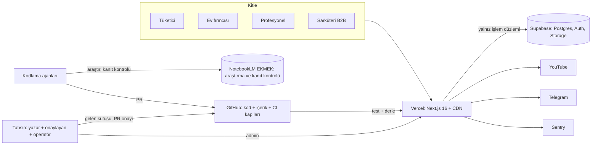
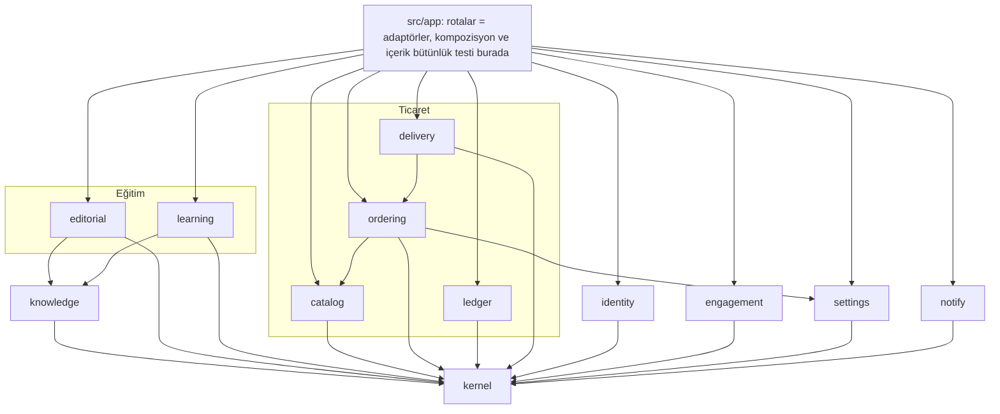
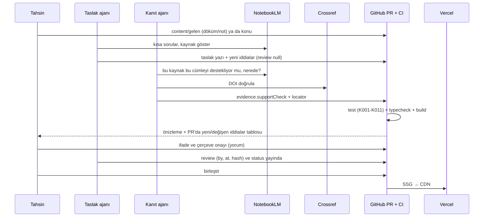

# EkmekLab — Sistem Mimarisi v1

> **Durum:** Tahsin onayladı (6 Ekim 2026). İş paketleri: [`IS_PAKETLERI.md`](IS_PAKETLERI.md) · Kararlar: [`adr/`](adr/) · Faz durumu: [`YOL_HARITASI.md`](YOL_HARITASI.md) (tek kaynak; çelişkide o geçerli).
> **Kanıt tabanı:** dosya:satır kanıtları `faz-4-konum-yasal` (726113f) üzerinden alındı. `src/lib/track.ts`, `src/app/api/track/`, `src/app/e/[slug]/`, `021_funnel_events.sql` bu belge yazılırken henüz `main`'de değildi (Kapı G0).
> **Yöntem:** 3 salt-okunur harita ajanı (içerik / ticaret-veri / platform) → taslak → 2 bağımsız çürütücü (kod tabanı + Next 16 uygunluğu; vizyon uyumu + kapsam disiplini) → 29 bulgu işlendi.

## 0. Amaç ve sınırlar

EkmekLab bir **eğitim platformu**; fırın onun laboratuvarı ve finans kaynağı. Bilgi yalnızca kanıtlı, kitle katmanlı (tüketici → ev fırıncısı → profesyonel), ziyaretçi meraklı ayrılmalı, temel sağlam olmalı ("sonsuz yeniden tasarım / yama değil").

**Tahsin'in kararları (6 Eki 2026):**
1. Eğitim içeriği **git'te dosya** (ADR-0002). Planlanan "020 `journal_articles` v2" iptal.
2. **Staging yok**; önizlemeler canlı veritabanına yazar (ADR-0005: kabul edilmiş risk + koruma + tetikleyici).
3. Atölyede sıcaklık kaydı + reçete/parti defteri var (kâğıt/telefon); pH ölçer yok.
4. 10x eksenleri: **içerik hacmi + ziyaretçi patlaması**. Ticari hacim ve paralel ajan sayısı eksen değil.

**Bu mimari seçmez (Tahsin'in kararları):** site iskeleti/menü, ana sayfa, pilot konu, kamera, içerik kapsamı (ekmek dışı konular). İçerik modeli hangi iskelet seçilirse seçilsin aynı yapı taşlarını kullanır (ADR-0004).

---

## 1. Vizyon stres testi ve kör noktalar

### 1.1 Varsayım → kırılma noktası

| # | Vizyon varsayımı | Bugün nerede kırılıyor (kanıt) | Mimari karşılık |
|---|---|---|---|
| V1 | "Yalnız kanıtlı bilgi" | Kaynaklar **3 uyumsuz biçimde**: `JournalCitation` (`src/types/journal.ts:3-10`), `CardSource {citation,url}` (`src/types/game.ts:365`, `src/lib/game/content/cards.ts:8-23`), serbest metin `docs/BILIM.md`. Yazı ↔ kart DOI kesişimi **0**. Canlı yazı tohumunda kaynaksız sağlık iddiaları: "Kansızlığı Önler", "%92 oranında parçalar", "gerçek bir şifa" (`src/data/journalArticles.ts:12,39,43`). Ürün sayfası ve modal `masterclass.healthBenefit` basıyor (`src/app/urun/[slug]/page.tsx:437-444`, `ProductModal.tsx:224`); admin formunda "Sindirim / sağlık" alanı (`src/app/admin/urunler/page.tsx:564`). | **Kanıt Grafiği** (Kaynak → İddia → Kavram) tek doğruluk kaynağı + CI kapıları (ADR-0003); QR trafiği başlamadan acil kapatma (P0-00). |
| V2 | 15 saat/hafta ile içerik üretimi | İnceleme tamamen Tahsin'e bağlı; her yazıda kanıt yeniden okunuyor. | **İki adımlı inceleme:** (1) "kaynak bu cümleyi destekliyor mu?" kontrolünü ayrı bir ajan NotebookLM üzerinden yapar ve kaydeder; (2) Tahsin cümlenin ifadesini (kendi sesi) ve yazının çerçevesini okur (~10–15 dk/yazı). Kanıt kontrolü iddia başına **bir kez**; iddia yeniden kullanılınca tekrarlanmaz. Dürüst maliyet: O(yazı) çerçeve + O(yeni iddia) kanıt. |
| V3 | "Site = marka evi, eğitim önde" | Ana sayfa = Hero + Katalog + HowWeBake; Kütüphane listesi `"use client"`; `/laboratuvar` noindex + robots disallow + menüde yok; `/kutuphane/yonetim` **herkese açık editör**, ana listeden linkli (`src/app/kutuphane/page.tsx:53`); iki ~800 satırlık kopya editör; Kütüphane verisi 3 yerde (statik TS + localStorage + kayıplı DB senkronu, `src/hooks/useJournal.ts`). | İçerik rotaları SSG; eski editör/depolar kalkar (P1-02); iskelet/ana sayfa Tahsin kararından sonra (D1). |
| V4 | Katmanlı kitle | Hiçbir içerikte seviye metadatası yok; kavram "usta / neden / bilim" katmanları (`docs/OYUN_V3.md` §1) ile kitle seviyeleri eşlenmemiş. | Her içerikte `levels: (1\|2\|3)[]`; eşleme: 1 tüketici → `usta`, 2 ev fırıncısı → `neden`, 3 profesyonel → `bilim`. |
| V5 | "Atölye deneyleri + ölçümler kanıttır" | Ölçümler kâğıtta/telefonda; sisteme hiçbir deney verisi girmiyor. | **Deney-önce:** seçilen deney verisi git'e CSV olarak (fotoğraftan ajan aktarır) → "Atölyede ölçtük" kaynağı (P2-01). Rutin parti kaydı yazılımı yalnız Tahsin isterse (P2-02). |
| V6 | Oyun = oynayarak öğrenme | Oyun yalıtık: içerik/ürün bağı yok; ilerleme yalnız localStorage; motor sabitlerinin kaynağı yorumda (`src/lib/game/engine/params.ts` başlığı: "yönün ve büyüklüğün doğru olması"); `src/lib/game/sim.ts:14` modül düzeyi değişken durum. | Kartlar kavramdan türer, sabitler "literatür" ya da "ayar" diye işaretlenir, öğrenme oturumu ölçülür (P1-05, P1-10). |
| V7 | Viral video → trafik | Anonim ziyaretçide proxy Supabase'e **gitmez** (oturum çerezi yok → `auth.getUser` ağ çağrısı yapmaz). Asıl yükler: (a) ana sayfa ve ürün sayfası **her ziyarette** `/api/settings`'i önbelleksiz çağırır (`src/hooks/useStoreSettings.ts:31` `no-store`; rota `force-dynamic` + `no-store`, `src/app/api/settings/route.ts:6,17`) → ziyaretçi başına 1 service-role DB okuması; (b) matcher her yolda (`src/middleware.ts:99-105`) → statik sayfalarda bile her istekte fonksiyon çağrısı; giriş yapmışta +2 Supabase çağrısı; (c) `/api/availability` POST hız sınırsız; (d) `public/atelier` 0,8–3,1 MB PNG, 30 ham ``. | **Trafik kalkanı** (P0-03); görsel hattı (P1-06); yük bütçesi (§2.6). |
| V8 | QR → ürün sayfası şeffaflığı | Ürün ↔ yazı/kart bağı yok; `ProductModal.tsx:235` var olmayan çapalara link; `EditorialArticleView.tsx:36-37` ürün bulunamazsa sessizce `allProducts[0]`. Admin'e yazılan ürün metnini hiçbir kural denetlemiyor. | Ürün ↔ içerik bağları + admin ürün API'sinde sağlık terimi reddi (P1-08). MARKA §7 kararı korunur: formül/oran kartı yok, yerine video. |
| V9 | Eğitim ücretsiz, satış finanse eder | "Sahte tam buğday" anlatırken ekmek satmak → çıkar çatışması algısı. Ürüne bağlı yazıda nötr bir mekanizma cümlesi ("uzun fermentasyonda X olur") + "bizim ekmeğimiz 24 saat" = **örtük fayda iddiası**. | Ürüne bağlı yüzey kodda tanımlı; orada sağlık terimi yasak; ürüne bağlı yazıda `<Claim>` kullanımı inceleme uyarısı (K006, K010). |
| V10 | Görsel/video/3D | `VideoFacadeCard` yalnız `youtubeId` ister, `videoUrl` yok sayılır; medya sahipliği/lisans kaydı yok (MARKA §8: stok görsel yok); VideoObject yapılandırılmış verisi yok. | Medya kaydı (lisans enum'u, alt metin zorunlu, ürün yüzeyinde stok yasak); YouTube + VideoObject; 3D önce önceden render video; Lab Büyüteci yazıya gömülür (P1-02, P1-05, P1-06). |
| V11 | Staging yok (karar) | Önizlemeler canlı DB'ye yazar; `tests/e2e/order-flow.spec.ts` ve `scripts/cleanup_test_orders.mjs` service-role ile canlı satır siler; `scripts/verify_after_migration.mjs` canlıya gerçek sipariş atar. | Önizleme koruması (P0-04). Tetikleyici: 2. insan katkıcı / online ödeme / ilk veri kazası. |
| V12 | Ajanlarla sağlam temel | GitHub varsayılan dalı `feature/location-ux-improvements`, CI yalnız `main`'de. `.github/` altında 3 Copilot dosyası Flutter/Firebase anlatıyor. `local_llm_bridge/` (node_modules dahil) izlenen 1528 dosyanın **1104**'ü. Üç çelişen palet: AGENTS.md koyu `#120E0B`, `docs/DESIGN_SYSTEM.md` üçüncü bir palet, MARKA §8 krem ✅; canlı koyu (`src/app/layout.tsx:99`). DB istemcileri `<any,any,any>` (`src/lib/supabase/admin.ts:3`); sipariş durumu 6, ödeme yöntemi 5, rol 4+ yerde (`src/types/admin.ts:4`'te DB'de olmayan `editor/support`). TypeScript 7.0.2 (derleyici API'si yok → dependency-cruiser desteklemiyor). | Bağlam hijyeni, bağımlılıksız mimari testleri, üretilen DB tipleri, tek kaynak enum'lar (P0-01, P0-02, P0-06; ADR-0008). |
| V13 | Ticari çekirdek sağlam | İki yazma yolu: tarayıcı `orders`/`payments`'a doğrudan yazıyor — canlı ekranlarda (`src/app/admin/siparisler/[id]/page.tsx`, `PaymentRecordModal.tsx` → `src/hooks/usePayments.ts:204-264`, iki ayrı yazım) ve `assignCourier` (`src/hooks/useAdminOrders.ts:272-291`). `src/app/api/orders/[id]/assign-courier/route.ts:88` doğrulanmamış `body.status` yazar. | **Tek yazar** + ödeme RPC'si (P1-09; ADR-0007). |
| V14 | Uçuştaki iş | `main` = `a8e17c0`. Faz-4 yığını (`faz-4-sepet-onar` → `faz-4-qr-olcum` → `faz-4-konum-yasal`: `021_funnel_events`, `/api/track`, `/e/[slug]`, sepet onarımları), `faz-4-baski` (etiket+QR, yarım) ve PR #15 (`faz-4-oyun-cavdar`) birleşmemiş. | **Kapı G0:** önce uçuştaki iş iner; yeni paketler ondan sonra `main`'den açılır. Yeni yapı 021'i **genişletir**, yeniden yazmaz (ADR-0006). |

### 1.2 Vizyonda eksik olan omurga bileşenleri ("bir adım ötesi")

1. **Kanıt Grafiği:** Kaynak (DOI/kitap/yönetmelik/atölye kaydı) → İddia (tek cümle, durum, güven, hassasiyet, kanıt-destek kontrolü, içeriğe bağlı onay) → Kavram (canlı, molekül, enzim, olay, tahıl, un, katkı, efsane, tarih; 3 katman). Sitedeki her bilimsel cümle bir iddia kimliğine izlenir.
2. **Yayın hattı + kalite kapıları:** taslak → inceleme → yayında; CI'da kopuk referans, DOI, sağlık beyanı, medya hakkı, onay-içerik uyumu denetimi.
3. **Gelen kutusu (Tahsin'in kendi malzemesi):** video dökümü, sesli not, defter fotoğrafı → `content/gelen/` → ajan taslak yazı + iddia önerisi üretir. MARKA §10 ("her uzun video → Kütüphane'de bir yazı") buna dayanır.
4. **İskeletten bağımsız içerik modeli:** yazı, kavram, kaynak, oyun bölümü, deney her iskelette aynı yapı taşları; iskelet kararı yalnız sunum katmanını kapsamlar.
5. **Deney kaydı:** fırını yayımlanabilir veri laboratuvarına çevirir; motor kalibrasyonu ve "Atölyede ölçtük" kaynakları.
6. **Öğrenme ölçümü:** yalnız ilgi eşiğini geçen ve örneklenen oturum özetleri; kimlik yok; "merak" ölçülebilir (süre, kart, tahmin isabeti).
7. **Medya kaydı:** sahiplik/lisans; stok görselin gerçekmiş gibi kullanılmasını yapısal olarak engeller.
8. **Simülasyon motoru bir ürün API'si:** yazıya gömülü büyüteç, profesyonel hesaplayıcılar (fırıncı yüzdesi, DDT, maya planı) aynı saf motordan.
9. **Etiket okuma aracı:** kullanıcı market ekmeğinin içindekiler listesini yapıştırır → her bileşen kaynaklı iddialarla açıklanır; "tam buğday mı?" kontrol listesi yönetmelik tanımından. Vizyondaki asıl boşluğu (katkı, malt, sahte tam buğday) hedefler — **hukuki teyitle**.
10. **Sahip olunan kanal** (bülten) ve **soru kutusu** (topluluk tohumu) — KVKK/İYS teyidiyle.

---

## 2. Üst seviye sistem mimarisi

**Stil:** Modüler monolit (tek Next.js 16 uygulaması, Vercel + Supabase), testle denetlenen modül sınırları (ADR-0001). **İki veri düzlemi:**
- **Bilgi düzlemi (git):** kaynak, iddia, kavram, yazı, medya kaydı, gezinme verisi. Testlerle doğrulanır, **statik import** ile pakete girer, SSG ile CDN'den sunulur, çalışma anında DB'ye ve dosya sistemine dokunmaz.
- **İşlem düzlemi (Supabase):** sipariş, cari, ürün/katalog, ayarlar, kimlik, ölçüm olayları (P2'de deney/parti).

### 2.1 Bağlam diyagramı



### 2.2 Alanlar ve modül sınırları

Modüller mevcut `src/lib/<modül>/` dizinlerinde kalır (dosya taşıma yok). Her modül: `index.ts` (saf, izomorfik genel API) · `server.ts` (`import "server-only"`, IO) · `types.ts` · `schema.ts` (zod) · `*.test.ts` (yalnız saf dosyaları içe aktarır). `src/app/**` ince adaptördür; modüller arası kompozisyon **yalnız `src/app`** içinde.

| Modül | Dizin | Sorumluluk | Veri sahipliği |
|---|---|---|---|
| kernel | `src/lib/kernel/` (yeni) + `src/lib/time/` | env (`appEnv`), log, `Result`, enum'lar (DB'den), migration listesi, mimari testi | — |
| knowledge | `src/lib/knowledge/` (yeni) | Kaynak/İddia/Kavram tipleri, `define*`, grafik doğrulayıcı, `ContentRef` sözleşmesi, sorgular, sağlık terimi listesi | `content/{sources,claims,concepts}` |
| editorial | `src/lib/editorial/` (yeni) + `src/components/editorial/` | Yazı metadatası, statik indeks, MDX bileşenleri, arama indeksi, gezinme verisi | `content/{articles,media,nav,gelen}` |
| learning | `src/lib/game/` (mevcut) | Saf motor, kart görünümleri, tahminler, ilerleme v4 | localStorage `ekmeklab_lab_v4` |
| catalog | `src/lib/products/` | Ürün, kategori | `products`, `categories`, `product_sale_dates`, `capacity_days` |
| ordering | `src/lib/ordering/`, `src/lib/order/`, `src/lib/orders/` | Uygunluk, sepet kuralları, sipariş yaşam döngüsü | `orders`, `order_items`, `payments`, `order_status_history` |
| ledger | `src/lib/cari/` | Cari defter | `current_accounts`, `account_transactions` |
| delivery | `src/lib/delivery/`, `src/lib/courier/` | Rota, teslim | — |
| identity | `src/lib/security/` | Oturum, rol, yetenek, imzalı link, hız sınırı | `profiles`, `rate_limit_buckets` |
| engagement | `src/lib/engagement/` (yeni; `src/lib/track.ts` buraya) | Olay sözleşmesi, beacon, örnekleme | `funnel_events` (021, genişler) |
| settings | `src/lib/settings/` | Mağaza ayarları | `bakery_settings` |
| notify | `src/lib/notify/` | Telegram | — |
| atelier (P2) | `src/lib/atelier/` | Deney/parti | `content/experiments` (P2-01), opt-in DB (P2-02) |



**Sınır kuralları** — dependency-cruiser TypeScript 7'yi desteklemediği için **bağımlılıksız** `src/lib/kernel/arch.test.ts` (import'ları regex ile toplar, `@/` → `src/`, izinli kenar tablosuyla karşılaştırır; ADR-0008):
- **R1** `knowledge` → yalnız `kernel` ve `content/{sources,claims,concepts}`. `content/**` → yalnız `@/lib/knowledge/define` ve `@/lib/editorial/define` (yalnız tip).
- **R2** Diyagramda olmayan modüller arası kenar yasak; eğitim ↔ ticaret bağı yalnız `src/app` içinde.
- **R3** İstemci dosyası sunucu modülü içe aktaramaz → `import "server-only"` + `next build` zaten kırar (ayrı test yok).
- **R4** `src/lib/firebase/**` içe aktarılamaz.
- **R5** `<any, any, any>` / `SupabaseClient<any` sayısı artamaz (cırcır testi).

### 2.3 Hedef dizin ağacı (yalnız yeni/değişen)

```
content/                              # Bilgi düzlemi (git)
  sources/   <konu>.ts                # defineSources({...})
  claims/    <konu>.ts                # defineClaims({...})
  concepts/  <tür>.ts                 # defineConcepts({...})
  articles/  <slug>/meta.ts           # defineArticle({...}) — tipli, vitest'ten okunur
             <slug>/index.mdx         # yalnız gövde; <Claim id="…"/> literal kimliklerle
  media/     registry.ts              # defineMedia({...})
  nav/       links.ts                 # nötr gezinme verisi (etiket + bağlantı)
  gelen/     <tarih>-<konu>.md        # Tahsin'in dökümü/notu → ajan taslağa çevirir
  experiments/<slug>/data.csv + meta.ts   # P2-01
  additives/ <grup>.ts                # P2-05
src/
  proxy.ts                            # middleware.ts yerine; matcher yalnız korumalı yollar
  mdx-components.tsx                  # Next 16 MDX dosyası (src içinde geçerli)
  components/editorial/               # Claim, Concept, Figure, Video, Sources (Tailwind tarar)
  lib/
    kernel/    env.ts log.ts result.ts enums.ts migrations.ts arch.test.ts
    knowledge/ types.ts define.ts registry.ts refs.ts validate.ts lint.ts query.ts
    editorial/ define.ts index.ts search.ts
    engagement/ events.ts client.ts server.ts
  app/__checks__/content.check.test.ts   # grafik + yazı + medya + kart + ürün yüzeyi bütünlüğü
  types/database.ts                   # supabase gen types (üretilen)
docs/
  MIMARI.md  IS_PAKETLERI.md  adr/0001…0008
```

### 2.4 Veri mimarisi ve akışı

**Depolar**

| Veri | Depo | Yazan | Okuyan | Tutarlılık |
|---|---|---|---|---|
| Kaynak/iddia/kavram/yazı/medya kaydı/gezinme | git `content/` | ajan PR + Tahsin onayı | statik import → SSG | CI testleri; dağıtım = sürüm |
| Ürün, kategori, satış günü, kapasite | Supabase | admin API | ISR + etiketli önbellek | RPC/zod |
| Sipariş, ödeme, durum geçmişi | Supabase | **yalnız** sunucu RPC/route | admin, takip | atomik RPC, iyimser kilit |
| Cari defter | Supabase | `record_cari_transaction_atomic` | admin, imzalı ekstre | SUM(delta) = bakiye |
| Huni + öğrenme olayları | Supabase `funnel_events` (021 + genişleme) | `/api/track` | günlük özet | kimlik yok; `props` ≤2 KB; saklama 13 ay |
| Öğrenen ilerlemesi | localStorage v4 | istemci | istemci | sürümlü şema + `migrateProgress` |
| Sepet, cihaz siparişleri | localStorage (mevcut) | istemci | istemci | sunucu fiyatı yeniden hesaplar |
| Görseller | `public/` + Supabase Storage `media` (P1-06) | admin | Vercel Image | içerik karması |
| Uzun video | YouTube | Tahsin | facade embed + VideoObject | — |
| Deney verisi (P2) | git `content/experiments/*/data.csv` | ajan (fotoğraf/CSV'den) | SSG grafik | CI şema testi |

**Önbellek stratejisi** (Next 16; `cacheComponents` / `"use cache"` **açılmaz**, YOL_HARITASI §9)

| Yüzey | Mod | Geçersiz kılma |
|---|---|---|
| Kütüphane, kavram, kaynak, arama indeksi | SSG (`generateStaticParams`, `dynamicParams = false`); indeks statik import'lu barrel'den; MDX gövdesi `import()` ile pakete girer | dağıtım |
| Ana sayfa, ürün sayfası | ISR 60 sn (mevcut) + `unstable_cache` etiketi `catalog`; içerik indeksi statik import (ISR yenilemesinde `fs` yok → dosya izleme sorunu yok) | admin ürün yazımında `revalidateTag("catalog", "max")` (Next 16 iki argüman ister) |
| `/api/settings` (genel alt küme) | `force-dynamic` kalkar; `unstable_cache` etiketi `settings` 60 sn + `Cache-Control: public, s-maxage=60, stale-while-revalidate=300`; `isCutoffPassed` istemcide `istanbul.ts` ile hesaplanır | admin ayar yazımında `revalidateTag("settings", "max")` |
| `/api/products` | mevcut `s-maxage=30, swr=120` | `catalog` |
| `/api/availability` | dinamik, önbelleksiz, **hız sınırlı** | — |
| Sipariş, cari, takip, olay | `no-store` | — |

**Durum yönetimi:** sunucu durumu RSC + route handler; istemci: zustand yalnız sepet; localStorage yalnız **cihaza ait, sürümlü** veri. **Yasak:** localStorage'ı veritabanı gibi kullanmak (`journalStorage.ts` deseni kalkar). Admin realtime değişmez (10x ekseni değil).

**Akış: bilgi hattı**



### 2.5 Entegrasyon ve arayüz sözleşmeleri

**Kimlik kuralları:** `src.<soyad>-<yıl>[-ek]`, `clm.<konu>.<kısa>`, `cpt.<kısa>`, `med.<kısa>`; slug ASCII kebab-case. Yayınlanmış kimlik değişmez (`supersededBy` ile emekliye ayrılır).

**knowledge** — iki aşamalı tipleme. Neden: referansı registry'ye işaret eden tipler (`supersededBy: ClaimId`, `parent: ConceptId`) registry'nin kendi başlatıcısında döngüsel tip (TS7022) üretir; değişken diziler içeren `const` tip parametresi kısıta düşer ve tüm kimlikler sessizce `string` olur.

```ts
// types.ts — GİRDİ tipleri: referanslar düz string, tüm diziler readonly
export type ISODate = `${number}-${number}-${number}`;
export type SourceKind = "makale" | "kitap" | "tez" | "yonetmelik" | "standart" | "atolye_kaydi" | "usta_bilgisi";
export interface SourceInput {
  kind: SourceKind; title: string; authors: readonly string[]; year: number;
  venue?: string; doi?: string; isbn?: string; url?: string; experiment?: string;
  verified: { via: "crossref" | "elle" | "ic_kayit"; at: ISODate };
  notebookLmTitle?: string;
}
export interface EvidenceInput {
  source: string; locator?: string;                       // sayfa/tablo/şekil — alıntı alanı YOK (telif)
  supportCheck?: { via: "notebooklm"; verdict: "destekliyor" | "kismen" | "desteklemiyor"; at: ISODate };
}
export type ClaimStatus = "dogrulandi" | "tartismali" | "efsane" | "geri_cekildi";
export interface ClaimInput {
  text: string; about: readonly string[];
  evidence: readonly [EvidenceInput, ...EvidenceInput[]];
  status: ClaimStatus; confidence: "yuksek" | "orta" | "dusuk";
  numbers?: readonly { label: string; value: number | readonly [number, number]; unit: string }[];
  sensitivity?: "saglik" | "yasal" | "karsilastirma";
  legalCheck?: { by: string; at: ISODate };                // saglik/karsilastirma için şart
  review: { by: "tahsin"; at: ISODate; hash: string } | null;   // hash = {text,evidence,numbers,status,sensitivity}
  supersededBy?: string;
}
export type ConceptKind = "canli" | "molekul" | "enzim" | "olay" | "tahil" | "un" | "katki" | "teknik" | "efsane" | "tarih";
export interface ConceptInput {
  kind: ConceptKind; name: string; latin?: string; nick?: string; aliases?: readonly string[];
  layers: { usta: string; neden: string; bilim: string };
  identity?: readonly { label: string; value: string; claim: string }[];   // kart "kimlik" satırları (şekil, boy, sıcaklık…)
  parent?: string; media?: readonly string[];
}

// define.ts — registry'yi ASLA içe aktarmaz
export const defineClaims = <const T extends Record<string, ClaimInput>>(t: T) => t;   // defineSources/defineConcepts aynı
export function claimHash(c: ClaimInput): string;      // kararlı JSON → kısa özet

// registry.ts — birleştir, kimlik tiplerini türet, referansları AYRI ifadede denetle
export const CLAIMS = { ...maya, ...gluten /* … */ };
export type ClaimId = Extract<keyof typeof CLAIMS, string>;   // SourceId, ConceptId aynı
const _claimRefs: { readonly [K in ClaimId]: { readonly about: readonly ConceptId[]; readonly supersededBy?: ClaimId;
  readonly evidence: readonly { readonly source: SourceId }[] } } = CLAIMS;   // kopuk referans = derleme hatası

// refs.ts — diğer modüllerin knowledge'a verdiği asgari sözleşme (knowledge editorial'ı içe aktarmaz)
export interface ContentRef {
  kind: "yazi" | "kart" | "urun" | "gezinme"; id: string; status?: "taslak" | "inceleme" | "yayinda" | "arsiv";
  surface: "icerik" | "urun";              // urun = meta.products'lı yazı, /urun, /e ve onlara bağlanan sayfalar
  claimIds: readonly string[]; conceptIds: readonly string[]; mediaIds: readonly string[]; text?: string;
}
export interface GraphIssue { code: `K${number}`; severity: "error" | "warn"; ref: string; message: string }
export function validateGraph(g: KnowledgeGraph, refs: readonly ContentRef[]): GraphIssue[];
export function claimsAbout(c: ConceptId): Claim[];
export function sourcesFor(ids: readonly ClaimId[]): Source[];
```

**Doğrulayıcı kodları** (her biri onu gerektiren paketle gelir; test `src/app/__checks__/content.check.test.ts`)

| Kod | Kural | Paket |
|---|---|---|
| K001 | yinelenen kimlik | P0-05 |
| K002 | kopuk referans (iddia→kaynak/kavram; yazı→iddia/kavram/medya; kart→kavram) | P0-05 (+kart P1-05) |
| K003 | kanıtsız iddia | P0-05 |
| K004 | DOI biçimi / doğrulama tarihi yok | P0-05 |
| K005 | yayındaki içerik `review: null`, `geri_cekildi` ya da `supersededBy` dolu iddia kullanıyor | P0-05 |
| K006 | Sağlık terimi (`lint.ts` `HEALTH_TERMS`: sağlıklı, şifa, iyileştir, tedavi, önler, korur, bağışıklık, detoks, sindirimi kolay, kansızlık, kolesterol, diyabet, zayıflat…) **yalnız** `efsane` bağlamında (efsaneyi düzelten iddia) serbest. Fayda bildiren sağlık iddiası `legalCheck` olmadan **hata**; `surface: "urun"` yüzeyinde **her durumda hata**. Nötr mekanizma cümlesi ("fitik asit %50–70 azalır") fayda fiili taşımadıkça serbest. | P0-05 (+ürün P1-08) |
| K007 | medya: alt metin / lisans eksik; `urun` yüzeyinde `stock-licensed` | P1-06 |
| K008 | iddiasız kavram (uyarı) | P0-05 |
| K009 | yazı özeti >160 karakter ya da `levels` boş | P1-02 |
| K010 | `surface: "urun"` yazıda `<Claim>` kullanımı (uyarı → Tahsin çerçeve okumasında bakar); `karsilastirma` iddiası `legalCheck`'siz (hata) | P1-08 |
| K011 | `review.hash` ≠ güncel `claimHash` → incelenmemiş sayılır (yayındaysa hata) | P0-05 |

**editorial**
```ts
export type AudienceLevel = 1 | 2 | 3;     // 1 tüketici→usta · 2 ev fırıncısı→neden · 3 profesyonel→bilim
export interface ArticleMetaInput {         // content/articles/<slug>/meta.ts → defineArticle({...})
  title: string; summary: string; levels: readonly AudienceLevel[]; concepts: readonly string[];
  status: "taslak" | "inceleme" | "yayinda" | "arsiv"; updatedAt: ISODate; publishedAt?: ISODate;
  hero?: string; video?: string; products?: readonly string[]; series?: string; fromInbox?: string;
}
export interface ArticleIndexEntry extends ArticleMetaInput { slug: string; claimsUsed: ClaimId[]; sourcesUsed: SourceId[]; readingMinutes: number }
export function articleIndex(): readonly ArticleIndexEntry[];   // statik import'lu barrel; fs yok
export function toContentRefs(): ContentRef[];                  // knowledge doğrulayıcısına adaptör
// MDX bileşenleri (src/components/editorial/, src/mdx-components.tsx): yalnız literal string id
// <Claim id="clm…"/> <Concept id="cpt…"/> <Figure media="med…"/> <Video media="med…"/> <Sources/>
// <Micro preset="…"/> ve <Predict id="…"/> P1-05'te learning'den gelir (tembel yükleme)
export interface NavLink { label: string; href: string; group?: string }   // nötr; iskelet kararından bağımsız
```
Yazı metadatası MDX içinde değildir: MDX'in ESM bloğu JavaScript olarak ayrıştırılır (`satisfies` hata verir), `tsc` `.mdx` dosyalarını denetlemez, vitest MDX içe aktaramaz.

**learning**
```ts
export interface CodexCardV4 { concept: ConceptId; art: string; microKey?: MicroEntityKind; rare?: boolean }
// görünür metin Concept.layers + nick + identity'den; kaynaklar iddialardan
export type Param<T = number> =
  | { value: T; claim: ClaimId }       // literatür (ör. kardinal sıcaklıklar, Gänzle 1998): değer iddianın numbers aralığında
  | { value: T; fitted: string };      // oyun için ayar: hangi kalibrasyon testine göre (engine.test.ts adı)
export interface LearnerProgressV4 {
  v: 4;
  cards: Record<ConceptId, { at: number; via: "lens" | "tahmin" | "bolum" | "okuma" }>;
  predictions: Record<string, { pick: number; correct: boolean; at: number }>;
  chapters: Record<string, { done: boolean; best?: number }>;
  reads: Record<string, { at: number; pct: number }>;
}
export function migrateProgress(raw: unknown): LearnerProgressV4;   // v1/v3 → v4, kayıpsız
export function toContentRefs(): ContentRef[];                       // kartlar → K002
```

**engagement** (021'i genişletir; olay adları korunur)
```ts
export type TrackEvent =
  | { name: "scan"; code: string; ref?: string }                    // 021 adları aynen
  | { name: "cart_open" } | { name: "checkout_start" }
  | { name: "order_ok"; orderId: string } | { name: "order_error"; code: string }
  | { name: "learning_session"; surface: "oyun" | "kutuphane" | "kavram"; durationSec: number;
      cardsUnlocked: number; predictions: { answered: number; correct: number };
      chaptersCompleted: readonly string[]; reads: readonly { slug: string; pct: number }[];
      entry: "qr" | "youtube" | "arama" | "dogrudan" | "diger" };
export function track(e: TrackEvent): void;   // learning_session: yalnız ≥30 sn ya da ≥1 kart, %20 örnek, pagehide'da 1 kez
export async function recordEvent(e: TrackEvent, env: AppEnv): Promise<void>;   // hata yutulur
```
Kimlik/oturum kimliği **yok** (KVKK; satırlar birleştirilmez). Sayfa görüntülenmesi DB'ye yazılmaz.

**identity**
```ts
export type Role = Database["public"]["Enums"]["user_role_type"];   // customer staff admin superadmin courier — tek kaynak
export type Capability = "orders.manage" | "orders.deliver" | "ledger.write" | "catalog.write" | "settings.write";
export const CAPABILITIES: Record<Capability, readonly Role[]>;
export async function requireCapability(req: Request, cap: Capability): Promise<Guard>;   // requireAdmin bunun özel hali
export interface RateLimitStore { hit(key: string, limit: number, windowMs: number): Promise<{ allowed: boolean }> }
export function rateLimit(store: RateLimitStore, opts: { failMode: "open" | "closed" }): RateLimiter;   // test edilebilir
```

**kernel**
```ts
export type AppEnv = "production" | "preview" | "development";
export function appEnv(): AppEnv;
export type Result<T, E extends string = string> = { ok: true; value: T } | { ok: false; error: E; message: string };
export const log: { info(e: string, f?: Record<string, unknown>): void; warn(e: string, f?: Record<string, unknown>): void; error(e: string, f?: Record<string, unknown>): void };   // JSON satır
export const EXPECTED_MIGRATIONS: readonly string[];   // yalnız ≥013 (000–012 app_migrations'a yazmaz); test: dizinle eşit
```

**HTTP uçları (yeni/değişen; hata zarfı `{ error: { code, message } }`)**

| Uç | Koruma | Hız sınırı | Not |
|---|---|---|---|
| `POST /api/track` (021) | yok | **bellek içi** en iyi çaba sınırı + 2 KB gövde sınırı (Postgres sınırlayıcı kullanılmaz → olay başına tek yazım) | `funnel_events` |
| `GET /api/settings` | yok | önbellekli (§2.4) | DB okuması 60 sn'de bir |
| `POST /api/availability` | yok | IP 60/10 dk, hata → açık | — |
| `GET /api/health` | genel `{ok}`; `?detail=1` → `requireAdmin` | — | ≥013 migration farkı |
| `POST /api/admin/orders/[id]/payments` | `requireCapability("orders.manage")` | — | `record_order_payment` RPC |

### 2.6 Güvenlik ve dayanıklılık

- **Yetki:** roller yalnız DB enum'u; tek `CAPABILITIES` haritası; admin handler'ın ilk satırı `requireAdmin`/`requireCapability` (AGENTS.md). İçerik düzenleme çalışma anında yetki istemez (git) → admin CMS saldırı yüzeyi kalkar.
- **Proxy:** `src/proxy.ts`, matcher yalnız `/admin/:path*`, `/kurye/:path*`, `/hesabim/:path*`, `/api/admin/:path*`. Oturum yenileme etkilenmez: çerezli sunucu istemcisini yalnız route handler'lar kullanır (`src/lib/security/apiAuth.ts`, `src/app/auth/callback`); sunucu bileşeni oturum okumuyor.
- **Hız sınırı politikası:** yazma uçları hata verince **kapanır** (sipariş, iptal, claim); okuma/ölçüm uçları **açılır**. `rate_limit_buckets` mevcut cron'da temizlenir; anahtarlarda ham IP yerine karma.
- **Tek yazar:** `orders`/`payments`/`order_status_history` yalnız sunucu yazar; tarayıcı politikaları SELECT'e iner (kod yayınından SONRA).
- **İçerik kapıları:** K001–K011; kanıtta alıntı alanı yok (telif); admin ürün API'si `HEALTH_TERMS` içeren metni reddeder (P1-08).
- **Önizleme → canlı koruması (staging yok kararı):** yan etkiler önizlemede ayırt edilir (Telegram `[TEST]` öneki mevcut; olaylar `env='preview'`); canlı veri silen script/e2e `ALLOW_PROD_WRITES=1` + `TEST` işareti olmadan çalışmaz; ajanlar service-role script'i çalıştırmaz.
- **Gizlilik ve üçüncü taraflar:** imzalı linkler (`/ekstre/<id>?t=`, `/fis/<id>?t=`, takip `?t=`) sorgu dizesinde → Sentry `beforeSend`/`beforeBreadcrumb` ve analitik sorgu dizesini siler; Sentry Replay **yok** (YOL_HARITASI Faz 5 kararı). Yeni veri işleyen (Sentry istemci, varsa Vercel Analytics) gizlilik/KVKK metnine **hukuki teyit** bayrağıyla eklenir.
- **Başlıklar:** CSP önce `Report-Only` (YouTube nocookie, Supabase, Vercel, Sentry), temizse zorunlu.

**Yük bütçesi ve bozulma matrisi**

| | İçerik/oyun | Ürün/ana sayfa | Sepet/sipariş | Admin |
|---|---|---|---|---|
| Ziyaretçi başına DB okuması | 0 | ≤1/60 sn (önbellek) | dinamik | — |
| Ziyaretçi başına DB yazımı | ≤0,2 (eşik + %20 örnek) | 0 | sipariş başına RPC | — |
| Supabase kapalı | %100 açık (statik) | ISR'ın son sürümü | "Sipariş şu an alınamıyor" (`failClosed`) | kapalı |
| YouTube kapalı | poster + metin | — | — | — |
| Telegram kapalı | — | — | sipariş etkilenmez (`after()`) | — |
| Ani trafik ×100 | CDN | CDN (ISR) | hız sınırı + kapasite kilidi | — |

### 2.7 Bilinçli olarak yapılmayanlar (ve tetikleyici)

| Yapılmıyor | Neden | Tetikleyici |
|---|---|---|
| Mikroservis, Kafka, outbox, GraphQL, Redis | ~100 ekmek/gün | >1000 sipariş/gün |
| Headless CMS / admin yazı editörü | git + PR seçildi; Tahsin için gelen kutusu var | 2. yazar git kullanamıyorsa |
| YAML/JSON içerik + kod üretimi | TS kaydı bağımlılıksız tipli denetim verir; tek kelimelik düzeltme GitHub web editöründe tırnak içinde güvenli; CI yakalar | Tahsin sık elle düzenliyorsa |
| Staging Supabase | Tahsin kararı | 2. insan katkıcı, online ödeme, ilk veri kazası |
| dependency-cruiser | TS 7 desteklemiyor | araç TS 7 desteği verirse |
| Kendi video barındırma, 3D motor, i18n | maliyet/odak | açık talep |
| Forum/yorum | moderasyon yükü | soru kutusu hacmi |
| Rutin parti kaydı yazılımı | 10x ekseni değil, günlük angarya | Tahsin isterse (P2-02) |
| Öğrenen hesabı senkronu | ölçülmemiş ihtiyaç | tekrar gelen öğrenen oranı |
| Advisory kilit / admin realtime refactor | ticari hacim eksen değil | o eksen açılırsa |
| Şema tabanı dökümü (`supabase db dump`) | makinede Docker / `pg_dump` yok | biri kurulunca |
