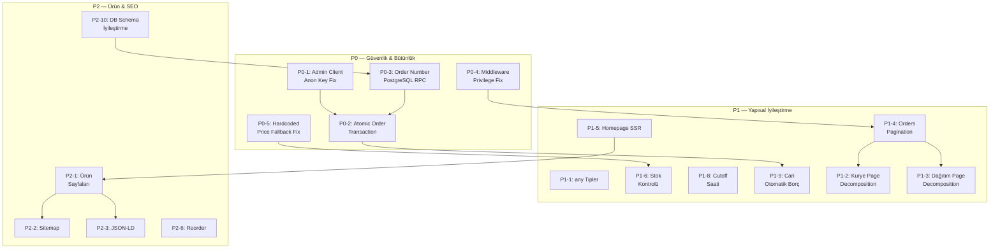

# 🍞 EkmekLab — Principal Engineer Audit Report

> **Tarih**: 26 Eylül 2026  
> **Kapsam**: Tüm repository incelemesi — Mimari, UX, Güvenlik, Performans, Operasyon, İş Mantığı  
> **Bakış Açısı**: Principal Engineer + Product Architect + UX/Product Strategist

---

## BÖLÜM 1: MEVCUT MİMARİ HARİTASI

### Gerçek Teknoloji Yığını

| Katman | Teknoloji | Durum |
|--------|-----------|-------|
| Frontend | Next.js 16, React 19, TypeScript 7 | ✅ Modern |
| Stil | Tailwind CSS 3.4 + Vanilla CSS | ✅ İyi |
| State | Zustand (persist) + React hooks | ✅ İyi |
| Animasyon | Framer Motion | ✅ İyi |
| Veritabanı | Supabase (PostgreSQL) + Firestore (legacy) | ⚠️ İkili |
| Auth | Supabase Auth (müşteri) + PIN JWT (admin) | ⚠️ Karma |
| Cloud Funcs | Firebase Cloud Functions (88KB `index.js`) | ⚠️ Kalıntı |
| Storage | Firebase Storage | ✅ |
| Realtime | Supabase Realtime (postgres_changes) | ✅ |
| AI | Gemini API (WhatsApp parser) | ✅ Yenilikçi |
| SEO | Next.js Metadata API | ⚠️ Kısıtlı |
| Test | Playwright (boş) | ❌ Yok |

### Rota Haritası (Gerçek)

```
MÜŞTERI YÜZLERİ:
/ ................ Ana sayfa (Hero + Katalog + Nasıl Üretiyoruz)
/kutuphane ....... Zanaat & Bilim Journal arşivi
/kutuphane/[slug]  Makale detay
/hesabim ......... Müşteri hesabı (oturum gerekli)
/siparis-takip/[id] Sipariş takip (halka açık, masked)
/fis/[id] ........ Teslimat Fişi / Tahsilat Makbuzu (halka açık)
/ekstre/[id] ..... Cari ekstre (halka açık)
/gizlilik ........ Gizlilik politikası
/kvkk ............ KVKK aydınlatma metni
/mesafeli-satis .. Mesafeli satış sözleşmesi

ADMIN:
/admin ........... Dashboard (KPI, son siparişler, mahalle dağılımı)
/admin/login ..... PIN girişi
/admin/siparisler  Sipariş listesi
/admin/siparisler/yeni  Manuel sipariş + WhatsApp Parser
/admin/siparisler/dagitim  Kurye rota yönetimi (1284 satır dev bileşen)
/admin/siparisler/[id]  Sipariş detay
/admin/urunler ... Ürün yönetimi
/admin/cariler ... Cari hesap yönetimi
/admin/finans .... Finans dashboard
/admin/finans/giderler  Gider yönetimi
/admin/finans/kasa  Kasa hareketleri
/admin/finans/kurye  Kurye mutabakat
/admin/uretim .... Üretim planlama
/admin/tedarikciler  Tedarikçi yönetimi
/admin/musteriler  Müşteri listesi
/admin/kutuphane . Journal yönetimi
/admin/kurye ..... Kurye yönetimi
/admin/ayarlar ... Ayarlar

KURYE:
/kurye ........... Kurye mobil konsol (1165 satır monolith)

API:
/api/orders/create ...... Sipariş oluştur (sunucu tarafı doğrulama)
/api/orders/[id] ........ Sipariş detay (yetkili/maskelenmiş)
/api/orders/my .......... Kullanıcının siparişleri
/api/admin/orders/parse . WhatsApp AI Parser
/api/admin/products ..... Ürün CRUD
/api/admin/settings ..... Ayarlar
/api/admin/auth ......... Admin auth
/api/admin/finans/transaction Finans işlemleri
/api/cron/cleanup-locations  KVKK konum temizliği
/api/journal ............ Journal API
/api/slip ............... Makbuz/fiş API
/api/auth ............... Auth API
```

### Veritabanı Tabloları

| Tablo | Amaç | İndeksler |
|-------|-------|-----------|
| profiles | Kullanıcı profili (Supabase Auth) | PK |
| saved_addresses | Kayıtlı adresler | user_id |
| categories | Ürün kategorileri | PK |
| products | Ürünler | PK, slug |
| orders | Siparişler | PK, idempotency_key |
| order_items | Sipariş kalemleri | order_id |
| order_status_history | Durum geçmişi | order_id |
| payments | Ödeme kayıtları | order_id |
| customer_locations | Müşteri GPS | order_id |
| couriers | Kuryeler | profile_id |
| current_accounts | Cari hesaplar | PK |
| account_transactions | Cari hareketler | account_id |
| suppliers | Tedarikçiler | PK |
| supplier_transactions | Tedarikçi hareketleri | supplier_id |
| financial_records | Finans kayıtları | PK |
| production_batches | Üretim partileri | product_id |
| journal_articles | Blog/journal | slug |
| bakery_settings | Fırın ayarları | key |

---

## BÖLÜM 2: WHAT IS GOOD — Korunması Gereken Güçlü Yönler

### 1. Marka & Tasarım Dili (⭐⭐⭐⭐⭐)
- **Olağanüstü renk sistemi**: `#12100E` koyu zemin, altın (`#C59B6D`), terakota (`#C86A46`), krem (`#FAF6F0`) — premium artisan hissi mükemmel.
- **Tipografi seçimi**: Fraunces (serif başlık), Lora (metin), Caveat (el yazısı), JetBrains Mono (telemetri) — çok iyi düşünülmüş, fırıncılık zanaat kimliğini dijitale taşıyor.
- **Noise texture overlay**: `noise-bg` CSS efekti organik his veriyor.
- **Tailwind design tokens**: Semantic color adları (`artisan-gold`, `surface-panel`, `artisan-terracotta`) profesyonel.

### 2. Sipariş Güvenliği (⭐⭐⭐⭐)
- **Sunucu tarafı fiyat doğrulaması**: Client gönderdiği fiyatlara güvenilmiyor — `createOrder` API'si ürünleri DB'den tekrar çekiyor.
- **Idempotency key**: Çift sipariş engelleniyor.
- **IP + telefon rate limiting**: Hem IP hem telefon bazlı rate limit var.
- **Zod schema doğrulaması**: Tüm input'lar zod ile doğrulanıyor.
- **Input sanitization**: XSS ve injection engeli.
- **Optimistic Locking**: `updateOrderStatus`'ta `.eq("status", currentStatus)` ile race condition koruması.

### 3. KVKK Uyumu (⭐⭐⭐⭐)
- **Konum verisi TTL**: 72 saat sonra otomatik temizlenen cron job (`cleanup-locations`).
- **Timing-safe cron auth**: `crypto.timingSafeEqual` ile timing attack koruması.
- **Gizlilik/KVKK/Mesafeli Satış sayfaları mevcut**.

### 4. Sipariş Takip Maskeleme (⭐⭐⭐⭐)
- `/api/orders/[id]` — Yetkisiz görüntülemelerde isim, telefon maskeleniyor; fiyatlar `null` döndürülüyor.
- Phone verification ile guest erişim.

### 5. Operasyon Altyapısı (⭐⭐⭐⭐)
- WhatsApp sipariş parser (Gemini AI ile) — gerçek operasyonel değer.
- Sipariş durumu geçmişi (audit trail) mevcut.
- Mahalle bazlı dağıtım, Beylikdüzü rota sıralaması.
- Cari hesap, tedarikçi, kasa, gider yönetimi.
- Üretim planlama (fermantasyon aşamaları).
- Kurye GPS tracking + realtime broadcast.

### 6. Supabase Realtime (⭐⭐⭐)
- `orders`, `products`, `production_batches`, `couriers` tabloları realtime publication'da.
- Hook'larda `removeChannel()` ile cleanup yapılıyor.

### 7. Security Headers (⭐⭐⭐)
- HSTS, X-Frame-Options, X-Content-Type-Options, Referrer-Policy, Permissions-Policy ayarlı.

---

## BÖLÜM 3: BIGGEST PROBLEMS — En Kritik Sorunlar

### 🔴 P0 — CRITICAL

#### P0-1: Admin Client Supabase ile Anon Key Fallback
- **Dosya**: [`src/lib/supabase/admin.ts`](file:///F:/ekmeklab_app/src/lib/supabase/admin.ts#L7)
- **Sorun**: Service role key bulunamazsa `NEXT_PUBLIC_SUPABASE_ANON_KEY` ile fallback yapıyor.
- **Risk**: Anon key ile oluşturulan "admin" client RLS bypass edemez. Ama `createAdminClient()` çağıran tüm API route'ları "bu client RLS'i bypass eder" varsayımıyla yazılmış. Anon key'e düşerse siparişler insert edilemez veya RLS izin verdiği kadarıyla işlem yapar — veri kaybı/corruption riski.
- **Çözüm**: Fallback kaldırılmalı. Service role key yoksa `null` dönmeli ve API route'lar buna göre 500 dönmeli.

#### P0-2: Sipariş Oluşturmada "Soft Fail" Paterni
- **Dosya**: [`src/app/api/orders/create/route.ts`](file:///F:/ekmeklab_app/src/app/api/orders/create/route.ts#L275-L379)
- **Sorun**: Supabase insert başarısız olursa (`supaOrderErr` truthy ise) hata sadece console.error'a yazılıyor ama müşteriye `success: true` dönülüyor. Order items, status history, payments hepsi try-catch içinde hata yutularak devam ediliyor.
- **Risk**: Müşteri "siparişiniz alındı" mesajı alırken gerçekte veritabanına yazılmamış olabilir. Finansal bütünlük kaybı. Phantom orders.
- **Çözüm**: DB insert başarısız olursa `success: false` dönülmeli. Tüm insert'ler tek transaction (atomic) içinde olmalı.

#### P0-3: Order Number Race Condition
- **Dosya**: [`src/lib/utils/orderNumber.ts`](file:///F:/ekmeklab_app/src/lib/utils/orderNumber.ts)
- **Sorun**: Sipariş numarası SELECT → increment → INSERT şeklinde JavaScript tarafında üretiliyor. İki eşzamanlı sipariş aynı numarayı alabilir. `order_number` kolonunda UNIQUE constraint yok.
- **Risk**: Duplike sipariş numaraları, finans karmaşası.
- **Çözüm**: PostgreSQL tarafında `generate_order_number()` RPC fonksiyonu oluşturulmalı (AGENTS.md'de de bu belirtilmiş ama implement edilmemiş).

#### P0-4: Middleware'de "Any Supabase User = Admin" Varsayımı
- **Dosya**: [`src/middleware.ts`](file:///F:/ekmeklab_app/src/middleware.ts#L41-L45)
- **Sorun**: Satır 41-45'te `if (user) { hasValidUserSession = true; isAuthenticatedAdmin = true; }` — herhangi bir Supabase auth kullanıcısı otomatik olarak admin sayılıyor.
- **Risk**: Bir müşteri `/admin` paneline erişebilir, `/api/admin/*` endpoint'lerine istek yapabilir. **Kritik privilege escalation**.
- **Çözüm**: Middleware'de kullanıcının `profiles.role` kontrol edilmeli.

#### P0-5: `useProducts` Hook'unda INITIAL_PRODUCTS ile Hardcoded Fiyatlar
- **Dosya**: [`src/hooks/useProducts.ts`](file:///F:/ekmeklab_app/src/hooks/useProducts.ts#L40-L446)
- **Sorun**: 400+ satır hardcoded ürün verisi. DB'ye ulaşılamazsa bu verilerle devam ediliyor. `createOrder` API'si de aynı fallback'i kullanıyor (satır 216).
- **Risk**: DB'deki gerçek fiyatlar değiştiğinde hardcoded eski fiyatlarla sipariş alınabilir. Kullanıcıya gösterilen fiyat ile DB fiyatı arasında tutarsızlık.
- **Çözüm**: Fallback verileri kaldırılmalı veya sadece yapısal/görsel amaçlı skeleton olarak kalmalı. Sipariş API'si asla fallback fiyata güvenmemeli.

### 🟠 P1 — HIGH

#### P1-1: `useFinans` Hook'unda `any` Tipleri
- **Dosya**: [`src/hooks/useFinans.ts`](file:///F:/ekmeklab_app/src/hooks/useFinans.ts#L12-L13)
- **Sorun**: `useState<any[]>([])` kullanılıyor. AGENTS.md kurallarına aykırı.
- **Risk**: Runtime type hataları, finansal hesaplama yanlışlıkları.

#### P1-2: Kurye Sayfası 1165 Satır Monolith
- **Dosya**: [`src/app/kurye/page.tsx`](file:///F:/ekmeklab_app/src/app/kurye/page.tsx) — 51KB, 1165 satır
- **Sorun**: Tek dosyada GPS tracking, settlement modal, order list, navigation, fullscreen toggle, sound alerts, reorder queue, delivery timer hepsi bir arada.
- **Risk**: Bakım edilemez, test edilemez, performans sorunu (her render tüm mantığı çalıştırıyor).

#### P1-3: Dağıtım Sayfası 1284 Satır Monolith
- **Dosya**: [`src/app/admin/siparisler/dagitim/page.tsx`](file:///F:/ekmeklab_app/src/app/admin/siparisler/dagitim/page.tsx) — 55KB, 1284 satır
- **Sorun**: Aynı problem — dev monolith.

#### P1-4: `useAdminOrders` Hook'unda Tüm Siparişler Çekilmesi
- **Dosya**: [`src/hooks/useAdminOrders.ts`](file:///F:/ekmeklab_app/src/hooks/useAdminOrders.ts#L98-L101)
- **Sorun**: `supabase.from("orders").select("*, order_items(*)").order(...)` — limit yok, filtresiz tüm siparişler + tüm kalemler çekiliyor.
- **Risk**: 500+ sipariş/gün senaryosunda sayfa açılış süresi 5-10 saniyeye çıkar. Hafıza problemi.
- **Çözüm**: Sunucu tarafında sayfalama, tarih filtresi, ve sadece aktif siparişler için JOIN.

#### P1-5: Supabase Client Singleton Sorunu
- **Dosya**: [`src/lib/supabase/client.ts`](file:///F:/ekmeklab_app/src/lib/supabase/client.ts)
- **Sorun**: Her hook çağrısında `createClient()` yeniden çağrılıyor. Hook'lar `useCallback` dependency'sine `supabase`'i koyuyor — bu da her render'da yeni referans oluşturabilir.
- **Risk**: Sonsuz render döngüsü, gereksiz API çağrıları, Realtime kanal sızıntısı.

#### P1-6: README ile Gerçek Mimari Uyuşmazlığı
- **Dosya**: [`README.md`](file:///F:/ekmeklab_app/README.md)
- **Sorun**: README hâlâ "Flutter Web Yönetim Paneli" ve "Hibrit mimari" anlatıyor. Admin paneli Next.js'e taşınmış ama README güncellenmemiş.
- **Risk**: Yeni geliştiriciler için kafa karışıklığı, yanlış yönlendirme.

#### P1-7: Firestore Rules ve Functions Kalıntısı
- **Dosyalar**: [`firestore.rules`](file:///F:/ekmeklab_app/firestore.rules) (461 satır), [`functions/index.js`](file:///F:/ekmeklab_app/functions/index.js) (88KB)
- **Sorun**: Aktif olarak kullanılmıyor ama bakım yükü oluşturuyor. Çelişkili mimari izlenimi.

#### P1-8: Ana Sayfa Tamamen Client-Side Rendered
- **Dosya**: [`src/app/page.tsx`](file:///F:/ekmeklab_app/src/app/page.tsx) — `"use client"`
- **Sorun**: Tüm sayfa client-rendered. Ürünler, hero, footer hepsi istemcide render ediliyor.
- **Risk**: SEO ciddi şekilde etkileniyor — arama motorları boş sayfa görüyor. FCP/LCP metrikleri kötü.
- **Çözüm**: Ürünler ve meta veriler SSR/RSC ile sunulmalı. Sadece interaktif kısımlar (sepet, modal) client olmalı.

#### P1-9: Stock Kontrolü Sipariş Anında Yok
- **Dosya**: [`src/app/api/orders/create/route.ts`](file:///F:/ekmeklab_app/src/app/api/orders/create/route.ts#L183-L256)
- **Sorun**: Sipariş oluşturulurken ürün fiyatı kontrol ediliyor ama stok kontrol edilmiyor. `is_available` veya `stock` alanlarına bakılmıyor.
- **Risk**: Tükenmiş ürünler sipariş edilebilir.

---

## BÖLÜM 4: MISSING FEATURES — Gerçekten Eksik Olanlar

### Operasyon Zinciri Analizi

```
ORDER ───→ PRODUCTION ───→ BAKING ───→ PACKING ───→ ROUTING ───→ DELIVERY ───→ PAYMENT
  ✅          ⚠️ Kısıtlı     ⚠️ Basit     ❌ Yok       ⚠️ Manuel    ✅ İyi        ⚠️ Kısıtlı
```

| Eksik Modül | Değer | Öncelik |
|-------------|-------|---------|
| **Sipariş cutoff saati** | Müşteriye "sipariş için son saat" gösterilmiyor | P1 |
| **Teslimat zaman penceresi** | Müşteri "14:00-18:00" seçemiyor, admin hardcoded | P2 |
| **Üretim → Sipariş bağlantısı** | Üretim partisi siparişlerle bağlanmıyor | P2 |
| **Paketleme listesi** | Dağıtım için otomatik çeki listesi yok | P2 |
| **Tekrar sipariş (Reorder)** | Müşteri son siparişini tekrar veremez | P1 |
| **Favori ürünler** | Kayıtlı kullanıcı favorileri yok | P3 |
| **Sipariş bildirimi (push/email)** | Sipariş alındı/hazırlanıyor/yolda bildirimi yok | P1 |
| **Abandoned cart** | Sepet terk analizi yok | P3 |
| **Minimum sipariş tutarı** | Minimum sipariş kontrolü yok | P2 |
| **Ürün SEO sayfaları** | Ürünlerin kendi `/urun/[slug]` sayfaları yok | P2 |
| **Sitemap.xml** | Otomatik sitemap üretimi yok | P2 |
| **Structured data (JSON-LD)** | Product schema, LocalBusiness schema yok | P2 |
| **Sipariş iptal (müşteri)** | Müşteri kendi siparişini iptal edemiyor | P3 |
| **Teslimat durumu push** | Kurye teslimata çıktığında bildirim yok | P2 |
| **Otomatik cari bakiye güncelleme** | Sipariş → cari borç yazma otomatik değil | P1 |

---

## BÖLÜM 5: ARCHITECTURE CHANGES — Gerekli Mimari Değişiklikler

### A1: SSR/RSC Geçişi (Ana Sayfa + Ürünler)
Homepage `"use client"` olmaktan çıkarılmalı. Ürünler sunucu bileşeninde Supabase'den çekilmeli. Sepet ve modal interaktif bileşenler ayrı client island olarak kalmalı.

### A2: Sipariş Oluşturmayı Transaction'a Alma
`/api/orders/create` içindeki tüm insert'ler (order, items, history, payment, location) tek PostgreSQL transaction'ı olmalı. `supabase.rpc('create_order_atomic', {...})` ile yapılmalı.

### A3: Gerçek Admin Auth — Middleware Düzeltmesi
Middleware'de `profiles.role` kontrol edilmeli. Admin onayı `user !== null` yerine `user.role IN ('admin', 'superadmin')` olmalı.

### A4: Hardcoded Ürün Verisinin Kaldırılması
`INITIAL_PRODUCTS` dizisi silinmeli veya sadece development seed'i olarak ayrı dosyaya taşınmalı. Hiçbir API route bu veriye fallback olarak güvenmemeli.

### A5: Firebase Kalıntısının Temizlenmesi
`firestore.rules`, `functions/index.js`, Flutter referansları README'den temizlenmeli. Firebase sadece Storage + Auth olarak kalacaksa açıkça belgelenmeli.

### A6: Database Schema İyileştirmeleri
- `order_number` kolonuna UNIQUE constraint
- `orders` tablosuna `delivery_time_window` kolonu
- `orders` tablosuna `cari_id` kolonu (foreign key → current_accounts)
- `account_transactions` tablosuna `balance_after`, `slip_number`, `order_id`, `payment_method` kolonları
- `products` tablosuna `min_order_quantity`, `display_order` kolonları
- Composite index: `orders(delivery_date, status)`
- Composite index: `orders(phone, created_at)` (rate limiting sorgusu)

---

## BÖLÜM 6: UX CHANGES — UX/UI Değişiklikleri

### Müşteri Deneyimi

| Sorun | Açıklama | Çözüm |
|-------|----------|-------|
| **Sepet Drawer uzunluğu** | 663 satır monolith, checkout akışı sepet drawer'ı içinde | Checkout'u ayrı adıma/sayfaya taşı |
| **Teslimat zamanı belirsizliği** | "Bugün 14:00-18:00 arası" hero'da sabit — gerçek cutoff kontrolü yok | Dinamik cutoff hesabı + countdown |
| **Konum paylaşımı UX** | Checkbox derin, GPS alım süreci açıklanmamış | Konum paylaşımını checkout'un son adımına taşı |
| **Sipariş sonrası** | `OrderSuccessModal` minimal — WhatsApp onay linki var ama tracking linki yok | Sipariş numarasıyla tracking linki göster |
| **Returning customer** | Giriş yapmış kullanıcının adresi otomatik dolmuyor | Kayıtlı adres dropdown'u |
| **Ürün detay** | Modal içinde, SEO yok, paylaşılamıyor | Kendi URL'si olan ürün sayfaları |
| **Güven sinyalleri** | Sosyal kanıt yok — müşteri sayısı, yorumlar, medya görünürlüğü | Minimal testimonial/counter |

### Kurye Deneyimi

| Sorun | Açıklama | Çözüm |
|-------|----------|-------|
| **Tek büyük sayfa** | 1165 satır — performans ve bakım problemi | Adım adım akışa böl |
| **Settlement modal karmaşıklığı** | Kurye teslimat + ödeme aynı flow'da | Ayrı "Teslimat Onayla" ve "Ödeme Al" adımları |
| **Offline durumu** | GPS veya internet kesilirse ne oluyor? | Offline state + retry queue |

### Admin Deneyimi

| Sorun | Açıklama | Çözüm |
|-------|----------|-------|
| **Tüm siparişler tek listede** | Filtreleme var ama "Bugünkü Aktif" vs "Geçmiş" ayrımı yok | Tab bazlı: Aktif / Geçmiş / İptal |
| **Üretim ↔ Sipariş bağı** | Üretim partisi oluştururken siparişler sadece sayı olarak gösteriliyor | Sipariş bazlı üretim planı |
| **Toplu işlem** | Birden fazla siparişi aynı anda "kuryede" yapma yok | Checkbox + bulk status update |

---

## BÖLÜM 7: SECURITY REVIEW

| Risk | Seviye | Durum | Açıklama |
|------|--------|-------|----------|
| **Privilege Escalation** | 🔴 Critical | Middleware'de herhangi bir user = admin | P0-4 |
| **Admin Client Fallback** | 🔴 Critical | Anon key'e fallback | P0-1 |
| **Sipariş Insert Soft-Fail** | 🔴 Critical | DB hatası yutulup success dönülüyor | P0-2 |
| **IDOR (Order Access)** | 🟢 Low | Phone verification + auth check iyi | Korunmalı |
| **Rate Limiting** | 🟡 Medium | IP + phone var ama in-memory (serverless restart = reset) | Redis/DB'ye taşı |
| **RLS Policies** | 🟢 Good | Tüm tablolarda RLS aktif | Korunmalı |
| **XSS/Injection** | 🟢 Good | `sanitizeInput()` + security headers | Korunmalı |
| **CSRF** | 🟡 Medium | Next.js varsayılan davranışı yeterli ama explicit token yok | Düşük öncelik |
| **Webhook Security** | 🟢 Good | Cron'da timing-safe compare var | Korunmalı |
| **Product CRUD Client Fallback** | 🟠 High | `useProducts.deleteProduct()` API başarısız olursa doğrudan Supabase client ile silme deniyor — RLS admin kontrolüyle güvenli ama kötü pattern | API-only yaklaşıma geç |
| **`useCustomerAuth` — `as any` cast** | 🟡 Medium | Supabase client `as any` cast ediliyor | Proper typing |

---

## BÖLÜM 8: PERFORMANCE / SCALABILITY

### Bugünkü Durumda Kırılma Noktaları

| Metrik | 100 sipariş/gün | 500 sipariş/gün | 2000 sipariş/gün |
|--------|-----------------|-----------------|-------------------|
| `useAdminOrders` — tüm veri çekme | ✅ OK | ⚠️ Yavaş (2-3s) | ❌ Kullanılamaz |
| `useFinans` — 3 hook chain | ✅ OK | ⚠️ Yavaş | ❌ N+1 sorgu patlaması |
| Realtime channels | ✅ OK | ⚠️ İzlenmeli | ❌ Broadcast limiti |
| In-memory rate limiter | ✅ OK | ⚠️ Restart'ta sıfırlanır | ❌ Serverless'ta anlamsız |
| `INITIAL_PRODUCTS` 450 satır import | ✅ OK | ✅ OK | ✅ OK (ama gereksiz) |
| Homepage SSR eksikliği | ⚠️ SEO kötü | ⚠️ SEO kötü | ⚠️ SEO kötü |

### Gerekli İyileştirmeler

1. **Sipariş sorgularına sayfalama** — `allOrders` yerine `limit(50)` + cursor pagination
2. **Composite index**: `(delivery_date, status)` — en sık kullanılan sorgu
3. **`useFinans` hook zincirinin kırılması** — sunucu tarafında aggregate view/function
4. **Rate limiter'ı persistent storage'a taşıma** — Supabase tablosu veya Redis

---

## BÖLÜM 9: SEO / DISCOVERY

| Kriter | Durum | Önem |
|--------|-------|------|
| `<title>` ve `<meta description>` | ✅ İyi (layout.tsx) | — |
| Open Graph | ✅ İyi (layout.tsx) | — |
| Ürün sayfaları (individual URL) | ❌ Yok | 🔴 Yüksek |
| Product JSON-LD Schema | ❌ Yok | 🔴 Yüksek |
| LocalBusiness JSON-LD | ❌ Yok | 🟠 Orta |
| Sitemap.xml | ❌ Yok | 🔴 Yüksek |
| robots.txt | ❌ Yok | 🟠 Orta |
| Canonical URL'ler | ⚠️ Kısmen (metadataBase var) | — |
| SSR/RSC ile ürün indexleme | ❌ Yok (full client render) | 🔴 Yüksek |
| `<h1>` hierarchy | ✅ İyi | — |
| Image alt text | ⚠️ Kısıtlı | 🟡 Düşük |
| Hreflang | N/A (tek dil) | — |
| Page speed (CWV) | ⚠️ Client render yüzünden LCP yüksek olabilir | 🟠 Orta |

---

## BÖLÜM 10: TECHNICAL DEBT

| Borç | Dosya(lar) | Çözüm |
|------|-----------|-------|
| **450 satır hardcoded ürün** | `useProducts.ts` | DB seed'e taşı, hook'tan kaldır |
| **1165 satır kurye page** | `kurye/page.tsx` | 5-6 bileşene böl |
| **1284 satır dağıtım page** | `dagitim/page.tsx` | 5-6 bileşene böl |
| **663 satır cart drawer** | `CartDrawer.tsx` | Checkout ayrı bileşen |
| **`any` tipler** | `useFinans.ts`, `useCariler.ts`, `useCustomerAuth.ts`, `useProducts.ts` | Proper typing |
| **Duplike `extractCoordinates`** | `kurye/page.tsx` + `dagitim/page.tsx` | Ortak utility'e taşı |
| **Duplike `BEYLIKDUZU_NEIGHBORHOODS`** | `admin.ts` + `CartDrawer.tsx` + `yeni/page.tsx` | Tek kaynak |
| **Duplike ürün mapping logic** | `useProducts.ts` — `fetchProducts` ve `reloadProducts` neredeyse aynı | Tek mapping fonksiyonu |
| **`useProducts` hook — `saveProduct` fallback** | İlk API dener, başarısız olursa client ile doğrudan DB'ye yazar | Sadece API |
| **Dead code: `createOrderInFirestore` alias** | `createOrder.ts` | Kaldır |
| **README Flutter/Hibrit referansları** | `README.md` | Güncelle |
| **`functions/index.js` — 88KB dead code** | `functions/` | Temizle veya arşivle |
| **`firestore.rules` — 461 satır** | `firestore.rules` | Minimal tut veya kaldır |

---

## BÖLÜM 11: AUTOMATION FIRSATLARI

| Otomasyon | Mevcut | Fayda | Zorluk |
|-----------|--------|-------|--------|
| **WhatsApp → Sipariş** | ✅ Gemini AI parser | Yüksek | ✅ Zaten var |
| **Sipariş → Üretim Planı** | ❌ | Çok Yüksek — otomatik günlük ekmek sayısı | Orta |
| **Üretim → Paketleme Listesi** | ❌ | Yüksek | Düşük |
| **Sipariş → Cari Borç Yazma** | ❌ | Yüksek — manuel hata riski ortadan kalkar | Orta |
| **Teslimat → Tahsilat Kaydı** | ⚠️ Kısmen | Orta | Düşük |
| **Günlük Rapor** | ❌ | Orta | Düşük |
| **Reorder Hatırlatması** | ❌ | Yüksek (müşteri retention) | Orta |
| **Cutoff Saati Otomatik Kontrolü** | ❌ | Yüksek | Düşük |

---

## BÖLÜM 12: DO NOT BUILD YET — Şimdilik Yapılmaması Gerekenler

| Özellik | Neden Yapılmamalı |
|---------|-------------------|
| **Online ödeme entegrasyonu** | Kapıda ödeme modeli iyi çalışıyor; online ödeme karmaşıklığı (PCI, iyzico/Stripe) şu an ROI vermez |
| **Müşteri loyalty/puan sistemi** | Müşteri tabanı yeterince büyük değil; operasyonel karmaşıklık > fayda |
| **Subscription/abonelik sistemi** | İş modeli henüz buna hazır değil; sipariş düzeni düzenli olsa bile ödeme otomasyonu zor |
| **Referral sistemi** | Henüz erken; önce retention |
| **Multi-branch / franchise** | Tek lokasyon; gereksiz abstraction |
| **İleri seviye route optimization (TSP)** | Beylikdüzü tek bölge, 5-20 teslimat/gün; Google Maps yeterli |
| **Envanter/reçete yönetimi** | Fırıncı zaten bilir; yazılım overhead'i yüksek |
| **Chatbot / AI asistan** | Gerçek operasyonel değer düşük |
| **Push notification altyapısı** | Önce WhatsApp/SMS ile başla |
| **A/B testing framework** | Erken optimizasyon |

---

## BÖLÜM 13: PRIORITIZED ROADMAP

### P0 — Critical (Hemen Yapılmalı)

| # | Task | Tahmini Süre |
|---|------|-------------|
| P0-1 | Admin client anon key fallback kaldırma | 30dk |
| P0-2 | Sipariş oluşturmayı atomic transaction'a çevirme | 4-6 saat |
| P0-3 | Order number PostgreSQL RPC'ye taşıma + UNIQUE constraint | 2-3 saat |
| P0-4 | Middleware privilege escalation düzeltme | 1-2 saat |
| P0-5 | INITIAL_PRODUCTS fallback'ini sipariş API'sinden kaldırma | 1 saat |

### P1 — High (1-2 Hafta İçinde)

| # | Task | Tahmini Süre |
|---|------|-------------|
| P1-1 | `any` tipleri kaldırma (finans, cariler, products) | 3-4 saat |
| P1-2 | Kurye page decomposition | 6-8 saat |
| P1-3 | Dağıtım page decomposition | 6-8 saat |
| P1-4 | Admin orders pagination + index | 4-6 saat |
| P1-5 | Ana sayfa SSR geçişi (SEO kritik) | 4-6 saat |
| P1-6 | Stok kontrolü sipariş anında | 2-3 saat |
| P1-7 | README güncelleme | 1 saat |
| P1-8 | Sipariş cutoff saati mekanizması | 3-4 saat |
| P1-9 | Otomatik cari borç yazma (sipariş → cari) | 4-6 saat |

### P2 — Medium (2-4 Hafta İçinde)

| # | Task | Tahmini Süre |
|---|------|-------------|
| P2-1 | Ürün detay sayfaları (`/urun/[slug]`) | 6-8 saat |
| P2-2 | Sitemap.xml + robots.txt | 2-3 saat |
| P2-3 | JSON-LD structured data (Product + LocalBusiness) | 3-4 saat |
| P2-4 | Duplike kod temizliği | 3-4 saat |
| P2-5 | Firebase kalıntısı temizliği | 2-3 saat |
| P2-6 | Tekrar sipariş (Reorder) özelliği | 4-6 saat |
| P2-7 | Teslimat zaman penceresi seçimi | 3-4 saat |
| P2-8 | Üretim → Sipariş bağlantısı | 4-6 saat |
| P2-9 | Checkout akışını iyileştirme | 4-6 saat |
| P2-10 | Database schema iyileştirmeleri (indeksler, kolonlar) | 3-4 saat |

### P3 — Future

| # | Task |
|---|------|
| P3-1 | Favori ürünler |
| P3-2 | Sipariş bildirimleri (WhatsApp/email) |
| P3-3 | Paketleme listesi otomasyonu |
| P3-4 | Günlük rapor otomasyonu |
| P3-5 | Müşteri segmentasyonu |
| P3-6 | CartDrawer decomposition |
| P3-7 | Minimum sipariş tutarı |
| P3-8 | Kurye kapasitesi yönetimi |

---

## BÖLÜM 14: TASK DEPENDENCY GRAPH



**Sıralama**:
```
DATABASE CHANGES (P2-10, P0-3)
    ↓
SERVER LOGIC (P0-1, P0-4, P0-2, P0-5, P1-6, P1-8)
    ↓
API (P1-4 pagination, P1-9 cari automation)
    ↓
ADMIN UI (P1-2, P1-3 decomposition)
    ↓
CUSTOMER UI (P1-5 SSR, P2-1 ürün sayfaları, P2-9 checkout)
    ↓
SEO (P2-2, P2-3)
    ↓
COURIER (P1-2)
```

---

## BÖLÜM 15: FLASH IMPLEMENTATION BRIEF

---

### TASK 1: Middleware Privilege Escalation Fix

**Priority**: P0-4  
**Why**: Herhangi bir Supabase kullanıcısı admin paneline erişebiliyor. Kritik güvenlik açığı.

**Current State**: [`src/middleware.ts`](file:///F:/ekmeklab_app/src/middleware.ts#L41-L45) — `if (user) { isAuthenticatedAdmin = true }`.

**Target State**: Sadece `profiles.role IN ('admin', 'superadmin')` olan kullanıcılar admin sayılmalı.

**Files to modify**:
- `src/middleware.ts`

**Implementation**:
```typescript
// Satır 41-45'i değiştir:
const { data: { user } } = await supabase.auth.getUser();
if (user) {
  hasValidUserSession = true;
  // Role check from profiles
  const { data: profile } = await supabase
    .from('profiles')
    .select('role')
    .eq('id', user.id)
    .single();
  if (profile?.role === 'admin' || profile?.role === 'superadmin') {
    isAuthenticatedAdmin = true;
  }
}
```

**Acceptance Criteria**:
- Müşteri hesabıyla `/admin` erişimi → `/admin/login`'e yönlendirme
- Admin hesabıyla `/admin` erişimi → normal çalışma
- PIN JWT ile erişim → normal çalışma (değişiklik yok)

**Risks**: Middleware'de Supabase sorgusu eklenmesi — her request'te ek DB call. Ancak sadece `/admin`, `/api/admin`, `/kurye` path'lerinde çalışıyor, diğer yolları etkilemiyor.

---

### TASK 2: Admin Client Anon Key Fallback Kaldırma

**Priority**: P0-1  
**Why**: Service role key yoksa anon key'e fallback, RLS bypass'ı çalışmaz.

**Files to modify**:
- [`src/lib/supabase/admin.ts`](file:///F:/ekmeklab_app/src/lib/supabase/admin.ts)

**Implementation**: Satır 7'deki fallback chain'i kaldır:
```typescript
// ÖNCE:
const serviceRoleKey = process.env.SUPABASE_SERVICE_ROLE_KEY || process.env.SUPABASE_SERVICE_KEY || process.env.SERVICE_ROLE_KEY || process.env.NEXT_PUBLIC_SUPABASE_ANON_KEY;

// SONRA:
const serviceRoleKey = process.env.SUPABASE_SERVICE_ROLE_KEY || process.env.SUPABASE_SERVICE_KEY || process.env.SERVICE_ROLE_KEY;
```

**Acceptance Criteria**: Service role key tanımlı değilken API route'lar 500 dönmeli, asla anon key kullanmamalı.

---

### TASK 3: Order Number PostgreSQL RPC

**Priority**: P0-3  
**Why**: Race condition — iki eşzamanlı sipariş aynı numarayı alabilir.

**Database changes**:
```sql
-- 1. UNIQUE constraint
ALTER TABLE public.orders 
  ADD CONSTRAINT uq_orders_order_number UNIQUE (order_number);

-- 2. Atomic sequence function
CREATE OR REPLACE FUNCTION public.generate_order_number()
RETURNS TEXT AS $$
DECLARE
  prefix TEXT;
  next_seq INTEGER;
  result TEXT;
BEGIN
  prefix := 'SIP-' || to_char(NOW(), 'YYMM') || '-';
  
  SELECT COALESCE(MAX(
    NULLIF(regexp_replace(order_number, prefix, ''), order_number)::INTEGER
  ), 0) + 1
  INTO next_seq
  FROM public.orders
  WHERE order_number LIKE prefix || '%'
  FOR UPDATE; -- Row lock prevents race condition
  
  result := prefix || lpad(next_seq::TEXT, 3, '0');
  RETURN result;
END;
$$ LANGUAGE plpgsql;
```

**Files to modify**:
- `src/lib/utils/orderNumber.ts` — `supabase.rpc('generate_order_number')` çağıracak şekilde basitleştir
- `src/app/api/orders/create/route.ts` — güncellenmiş fonksiyonu kullan

**Acceptance Criteria**: 10 eşzamanlı sipariş → 10 farklı sipariş numarası.

---

### TASK 4: Atomic Order Creation Transaction

**Priority**: P0-2  
**Depends on**: P0-1, P0-3

**Why**: Sipariş insert başarısız olsa bile müşteriye success dönülüyor.

**Database changes**: PostgreSQL function oluştur:
```sql
CREATE OR REPLACE FUNCTION public.create_order_atomic(
  p_order JSONB,
  p_items JSONB[],
  p_user_id UUID DEFAULT NULL
) RETURNS JSONB AS $$
DECLARE
  v_order_number TEXT;
  v_order_id TEXT;
BEGIN
  -- Generate order number atomically
  v_order_number := generate_order_number();
  v_order_id := p_order->>'id';
  
  -- Insert order
  INSERT INTO orders (id, order_number, ...) 
  VALUES (v_order_id, v_order_number, ...);
  
  -- Insert items
  INSERT INTO order_items (...) 
  SELECT ... FROM unnest(p_items);
  
  -- Insert audit log
  INSERT INTO order_status_history (...) VALUES (...);
  
  -- Insert payment
  INSERT INTO payments (...) VALUES (...);
  
  RETURN jsonb_build_object('order_number', v_order_number, 'success', true);
END;
$$ LANGUAGE plpgsql;
```

**Files to modify**:
- `src/app/api/orders/create/route.ts` — tüm ayrı insert'leri tek RPC call'a dönüştür
- Yeni migration dosyası oluştur

**Acceptance Criteria**: DB hatası → müşteriye hata mesajı. Kısmi insert yok.

---

### TASK 5: Hardcoded Product Fallback Kaldırma (Sipariş API)

**Priority**: P0-5

**Files to modify**:
- [`src/app/api/orders/create/route.ts`](file:///F:/ekmeklab_app/src/app/api/orders/create/route.ts#L214-L227)

**Implementation**: Satır 214-227 (INITIAL_PRODUCTS fallback) kaldır. Ürün DB'de bulunamazsa 404 dön (bu zaten 229-233'te yapılıyor).

Ayrıca: Dosya başındaki `import { INITIAL_PRODUCTS }` kaldır.

**Acceptance Criteria**: DB'de olmayan ürünle sipariş → 404, hardcoded fiyatla sipariş imkansız.

---

### TASK 6: Sipariş Stok Kontrolü

**Priority**: P1-6

**Files to modify**:
- `src/app/api/orders/create/route.ts`

**Implementation**: Ürün sorguladıktan sonra stok kontrolü ekle:
```typescript
if (productData.is_available === false) {
  return NextResponse.json(
    { success: false, error: `${productData.name} şu an stokta bulunmuyor` },
    { status: 400 }
  );
}
```

---

### TASK 7: Homepage SSR Geçişi

**Priority**: P1-5

**Current State**: [`src/app/page.tsx`](file:///F:/ekmeklab_app/src/app/page.tsx) — `"use client"`, tüm sayfa client-rendered.

**Target State**: Ürünler sunucu bileşeninde Supabase'den fetch edilmeli. Sepet ve modal client island olarak kalmalı.

**Files to modify**:
- `src/app/page.tsx` — `"use client"` kaldır, RSC yap
- `src/components/storefront/ProductCatalog.tsx` — props alacak şekilde refactor
- Yeni: `src/app/page.server.ts` veya inline Supabase fetch

**Implementation approach**:
```typescript
// src/app/page.tsx — RSC
import { createClient } from '@/lib/supabase/server';

export default async function HomePage() {
  const supabase = await createClient();
  const { data: products } = await supabase
    .from('products')
    .select('*')
    .eq('is_active', true)
    .order('is_popular', { ascending: false });
  
  return (
    <div>
      <Navbar /> {/* Client component */}
      <AtelierThresholdHero /> {/* Can be server */}
      <ProductCatalog initialProducts={products} /> {/* Hydrated */}
      <HowWeBake /> {/* Can be server */}
      <Footer /> {/* Can be server */}
      <CartDrawer /> {/* Client */}
      <OrderSuccessModal /> {/* Client */}
    </div>
  );
}
```

---

### TASK 8: Admin Orders Pagination

**Priority**: P1-4

**Files to modify**:
- `src/hooks/useAdminOrders.ts`

**Implementation**: Tarih filtresi default "bugün" ve sayfalama ekle:
```typescript
const { data, error } = await supabase
  .from("orders")
  .select("*, order_items(*)", { count: 'exact' })
  .gte("delivery_date", todayStr) // default: bugünden itibaren
  .order("created_at", { ascending: false })
  .range(page * pageSize, (page + 1) * pageSize - 1);
```

**Database changes**: 
```sql
CREATE INDEX idx_orders_delivery_date_status ON public.orders(delivery_date, status);
CREATE INDEX idx_orders_created_at ON public.orders(created_at DESC);
```

---

### TASK 9: Kurye Page Decomposition

**Priority**: P1-2

**Current State**: [`src/app/kurye/page.tsx`](file:///F:/ekmeklab_app/src/app/kurye/page.tsx) — 1165 satır, 51KB monolith.

**Target State**: Ayrı bileşenler:
```
src/app/kurye/page.tsx ...................... Orchestrator (100 satır max)
src/components/courier/CourierHeader.tsx ..... Header + date/courier filters
src/components/courier/CourierOrderCard.tsx .. Tek sipariş kartı
src/components/courier/CourierNavPanel.tsx ... GPS navigation panel
src/components/courier/CourierSettlement.tsx . Teslimat + ödeme onay modalı
src/components/courier/CourierGPSTracker.tsx . GPS tracking logic
src/components/courier/CourierQueueManager.tsx Sıralama mantığı
```

---

### TASK 10: Database Schema İyileştirmeleri

**Priority**: P2-10

**Migration file**: `supabase/migrations/010_schema_improvements.sql`

```sql
-- Order number uniqueness
ALTER TABLE public.orders ADD CONSTRAINT uq_orders_order_number UNIQUE (order_number);

-- Performance indexes
CREATE INDEX IF NOT EXISTS idx_orders_delivery_date_status 
  ON public.orders(delivery_date, status);
CREATE INDEX IF NOT EXISTS idx_orders_phone_created 
  ON public.orders(phone, created_at DESC);
CREATE INDEX IF NOT EXISTS idx_orders_user_id 
  ON public.orders(user_id) WHERE user_id IS NOT NULL;

-- Cari integration
ALTER TABLE public.orders ADD COLUMN IF NOT EXISTS cari_id TEXT 
  REFERENCES public.current_accounts(id) ON DELETE SET NULL;
ALTER TABLE public.orders ADD COLUMN IF NOT EXISTS delivery_time_window TEXT;

-- Account transactions enrichment
ALTER TABLE public.account_transactions ADD COLUMN IF NOT EXISTS balance_after NUMERIC(12, 2);
ALTER TABLE public.account_transactions ADD COLUMN IF NOT EXISTS slip_number TEXT;
ALTER TABLE public.account_transactions ADD COLUMN IF NOT EXISTS order_id TEXT;
ALTER TABLE public.account_transactions ADD COLUMN IF NOT EXISTS payment_method TEXT;

-- Products ordering
ALTER TABLE public.products ADD COLUMN IF NOT EXISTS display_order INTEGER DEFAULT 0;
ALTER TABLE public.products ADD COLUMN IF NOT EXISTS min_order_quantity INTEGER DEFAULT 1;
```

---

## BÖLÜM 16: SONUÇ

### Bu Ürün Hakkında Genel Değerlendirme

EkmekLab, bir artisan fırının dijital dönüşümü için **olağanüstü derecede kapsamlı ve iyi düşünülmüş** bir ürün. Marka deneyimi, tasarım dili ve operasyonel derinliği (cari muhasebe, üretim planlama, WhatsApp AI parser, kurye GPS tracking) küçük bir fırın uygulaması için çok ileri seviyede.

Ancak **kritik güvenlik açıkları** (middleware privilege escalation, soft-fail order creation, anon key fallback) ve **yapısal teknik borç** (monolith bileşenler, hardcoded ürün verisi, full client-side rendering) ürünün production'a çıkmadan önce çözülmesi gereken sorunlar.

**Öncelik sıralaması net**: Önce güvenlik (P0), sonra performans ve SEO (P1), sonra özellik geliştirme (P2).

**Ana felsefe**: Yeni özellik eklemek yerine mevcut temeli sağlamlaştırmak. Bu ürün zaten özellik açısından zengin — eksik olan sağlamlık, güvenlik ve SEO.
